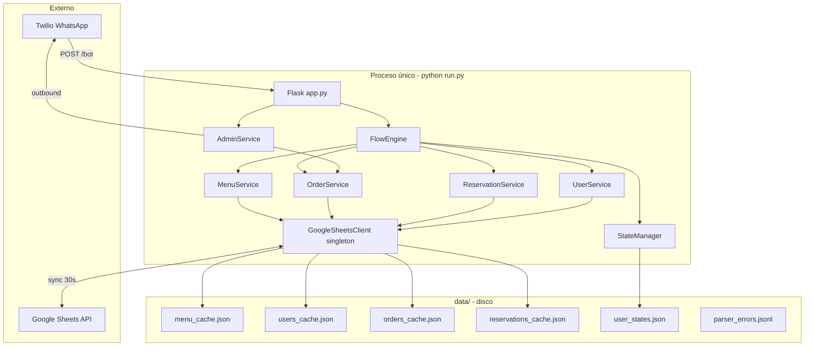
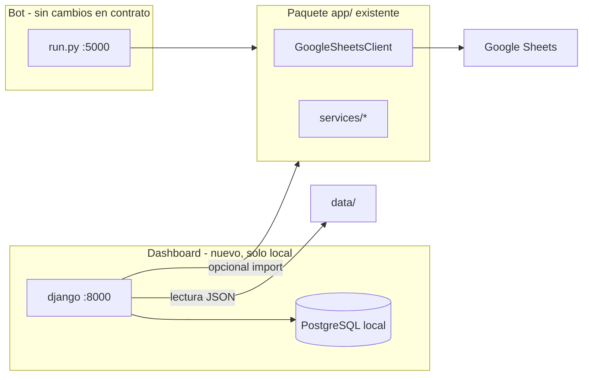

# Auditoría y plan maestro — Dashboard Django + PostgreSQL (local)

## 1. Diagnóstico

### 1.1 Qué es el sistema hoy

Bot conversacional de restaurante en **producción** sobre:

| Capa | Tecnología | Rol |
|------|------------|-----|
| HTTP / webhook | Flask + Waitress (`run.py`) | `POST /bot`, `GET /health`, `POST /bot/reload-flow` |
| Canal | Twilio WhatsApp | Entrada de mensajes; salida admin/cliente |
| Motor conversacional | `FlowEngine` + `flows/restaurant_flow.json` | Flujo declarativo, sin tocar Python para cambiar nodos |
| Estado conversacional | `StateManager` | Por `wa_id`; JSON opcional `data/user_states.json` |
| Parser NL | `app/core/parser.py` (~1500 líneas) | Carrito, cantidades, fuzzy match |
| Persistencia de negocio | `GoogleSheetsClient` | MENU, USERS, ORDERS, RESERVATIONS |
| Caché local | `data/*.json` | Write-through + sync cada 30 s a Sheets |
| Admin operativo | `AdminService` vía WhatsApp | Confirmar pedidos, recordatorios Twilio |

**No existe panel web.** La administración es 100 % WhatsApp (`ADMIN_WHATSAPP_NUMBER`).

### 1.2 Arquitectura actual (diagrama)



### 1.3 Flujo de datos (resumen)

**Mensaje cliente**

1. Twilio → `POST /bot` (`WaId`, `ProfileName`, `Body`).
2. Si `wa_id` == admin → `AdminService.handle_admin_message` (confirmar `ORD-…`).
3. Si no → `UserService.touch` + `FlowEngine.process_message`.
4. Acciones del flujo leen menú vía caché, escriben carrito en `StateManager`, al guardar pedido/reserva → `GoogleSheetsClient` marca dirty y persiste JSON local; hilo background empuja a Sheets en ~30 s.
5. Nuevo pedido → `AdminService.notify_new_order` (Twilio al admin).

**Fuentes de verdad (orden práctico)**

| Dato | Fuente primaria (con Sheets) | Fallback demo |
|------|------------------------------|---------------|
| Menú | Sheet MENU → `menu_cache.json` | `DEMO_MENU` en memoria |
| Pedidos | Sheet ORDERS + `orders_cache.json` | Lista en memoria |
| Usuarios | Sheet USERS + `users_cache.json` | Dict demo en memoria |
| Reservas | Sheet RESERVATIONS + `reservations_cache.json` | Solo ID generado |
| Estado chat | `user_states.json` | Solo memoria si no hay path |

### 1.4 Integraciones externas

| Integración | Uso | Variables |
|-------------|-----|-----------|
| **Twilio** | Webhook entrante; mensajes salientes admin/cliente | `TWILIO_*`, `ADMIN_WHATSAPP_NUMBER` |
| **Google Sheets** | CRUD lógico de menú, usuarios, pedidos, reservas | `GOOGLE_SPREADSHEET_ID`, credenciales archivo o `GOOGLE_SERVICE_ACCOUNT_JSON` |
| **ngrok** (dev) | Exponer `/bot` | Documentación, no código |

**No hay:** Redis, colas, OAuth web, base SQL, API REST pública más allá de los 3 endpoints Flask.

### 1.5 Endpoints y contratos (inmutables según restricciones)

| Método | Ruta | Contrato |
|--------|------|----------|
| GET | `/health` | JSON `status`, `caches`, `admin_configured` |
| POST | `/bot` | Form Twilio → XML `MessagingResponse` |
| POST | `/bot/reload-flow` | JSON `{status: flow reloaded}` — **sin autenticación** |

### 1.6 Riesgos detectados (estado actual)

| Riesgo | Severidad | Nota |
|--------|-----------|------|
| `/bot/reload-flow` sin auth | Alta (prod) | Ya documentado en README; dashboard no debe empeorar esto |
| Dos procesos escribiendo mismos JSON (`data/`) | Alta (si dashboard escribe) | Corrupción / dirty flags inconsistentes |
| Caché duplicado por proceso | Media | Dashboard en proceso distinto verá datos con lag ~30 s |
| `MENU_CACHE_TTL_SECONDS` / `ORDERS_CACHE_TTL_SECONDS` en `.env` no usados en código | Baja | Sync fijo `MENU_LOCAL_REFRESH_SECONDS = 30` en `google_sheets.py` |
| Admin solo por WhatsApp | Operativa | Motivo del dashboard |
| `users_cache.json` modificado en git status | Media | Datos runtime en repo; dashboard debe respetar `.gitignore` patterns |
| Parser y flow_engine críticos | Alta | Cualquier import cruzado mal hecho puede acoplar arranque pesado al dashboard |
| Despliegue single-container | Media | Dashboard **no** debe ir en el mismo `CMD` que el bot en Render/Railway sin decisión explícita |

### 1.7 Oportunidades alineadas al objetivo

- **Lectura** desde `data/*.json` + lectura directa Sheets (misma lib `gspread`) sin tocar Flask.
- **Escrituras** solo vía API de Sheets o importando `GoogleSheetsClient` en comandos Django, nunca reimplementando lógica dirty.
- **PostgreSQL** para lo que Sheets no cubre bien: usuarios staff, preferencias UI, auditoría de acciones del panel, snapshots opcionales.
- Mantener bot en `python run.py` y dashboard en `python dashboard/manage.py runserver` (puertos distintos).

---

## 2. Arquitectura propuesta (incremental)

### 2.1 Principio rector

**Proceso dual, código compartido, contratos intactos.**



### 2.2 Responsabilidades

| Componente | Responsabilidad |
|------------|-----------------|
| **Flask (actual)** | Twilio, flujo, parser, admin WhatsApp — sin cambios de contrato |
| **Django (nuevo)** | UI admin local: listados, filtros, confirmación manual, visor menú/reservas |
| **PostgreSQL (local)** | Auth staff, audit log, config de panel, snapshots/sync opcional |
| **Google Sheets** | Sigue siendo fuente de verdad de negocio salvo que más adelante se decida migración (fuera de alcance inicial) |

### 2.3 Reglas de escritura (evitar conflictos)

1. **Fase 1–2:** solo lectura de `data/` y/o Sheets.
2. **Fase 3+:** escrituras de negocio **preferentemente** vía `GoogleSheetsClient` en `manage.py` one-shot o vista Django que llama métodos existentes (`update_order_status`, edición menú en Sheets), **no** edición manual de JSON dirty.
3. **Nunca** editar `user_states.json` desde el dashboard en v1.
4. Dashboard local mientras bot corre en cloud → sin conflicto de archivos; si ambos locales, documentar “detener bot o solo lectura”.

### 2.4 Estructura de carpetas propuesta (sin implementar aún)

```
chatbot-cursor/
  app/                    # sin mover
  flows/
  data/
  dashboard/              # nuevo proyecto Django
    manage.py
    config/
    apps/
      core/               # health bridge, utils
      operations/         # orders, reservations, menu views
      accounts/           # staff users
  docker-compose.yml      # solo postgres local
  requirements-dashboard.txt  # o extras en requirements-dev.txt
```

---

## 3. Fases (4 fases — dentro del rango 3–5)

| Fase | Nombre | Riesgo | Cambia bot |
|------|--------|--------|------------|
| 1 | Fundación Django + PostgreSQL local | Bajo | No |
| 2 | Dashboard lectura operativa | Bajo | No |
| 3 | Auth staff + datos de panel en PG | Bajo–medio | No |
| 4 | Acciones seguras de administración | Medio | Mínimo (solo si hace falta flag/env) |

No se justifica una 5.ª fase obligatoria: sync programado y métricas pueden ser extensión opcional post-v1.

---

## 4. Dependencias nuevas

| Paquete | Uso | Dónde |
|---------|-----|-------|
| `Django` (LTS, ej. 5.1.x) | Panel | `requirements-dashboard.txt` |
| `psycopg2-binary` o `psycopg[binary]` | PostgreSQL | idem |
| `django-environ` (opcional) | Config | idem |
| `whitenoise` (opcional) | Estáticos | idem |

**No añadir:** Celery, Redis, DRF completo, Channels, GraphQL, frontend SPA pesado (admin Django basta en v1).

**Infra local:** `docker compose` con imagen `postgres:16-alpine` (solo desarrollo).

El bot mantiene `requirements.txt` actual intacto hasta que se decida unificar en monorepo con extras opcionales.

---

## 5. Fases detalladas

### Fase 1 — Fundación Django + PostgreSQL local

**Objetivo:** Proyecto Django aislado, PG en Docker, arranque documentado, cero impacto en Twilio.

**Entregables**

- `dashboard/` con `manage.py`, settings `DATABASES` → PostgreSQL local.
- `docker-compose.yml` (servicio `db`, volumen, puerto 5432).
- `.env.dashboard.example` (`DATABASE_URL`, `DJANGO_SECRET_KEY`, `DEBUG=1`).
- README sección “Dashboard local” (dos terminales: bot + dashboard).
- Comando de verificación: migraciones Django + `GET /health` del bot sigue OK.

**Archivos afectados (nuevos / tocados mínimos)**

| Acción | Archivo |
|--------|---------|
| Crear | `dashboard/**`, `docker-compose.yml`, `requirements-dashboard.txt`, `.env.dashboard.example` |
| Tocar | `README.md` (documentación), opcional `.gitignore` (`dashboard/.env`) |
| No tocar | `app/app.py`, `app/core/*`, `flows/*` |

**Riesgo:** Bajo.  
**Rollback:** Eliminar carpeta `dashboard/`, compose y requirements-dashboard; bot intacto.

---

### Fase 2 — Dashboard lectura operativa

**Objetivo:** Ver menú, pedidos pendientes/confirmados, reservas, usuarios y estado de caché sin modificar datos.

**Fuentes de lectura (orden)**

1. `data/orders_cache.json`, `menu_cache.json`, `users_cache.json`, `reservations_cache.json`.
2. Si vacío o desactualizado: instanciar `GoogleSheetsClient` con mismas env que el bot (import desde `app.integrations.google_sheets`).
3. `GET` proxy interno opcional: llamada HTTP a `http://localhost:5000/health` (no nuevo endpoint).

**Vistas Django (admin o templates simples)**

- Lista pedidos con filtro `status=pending`.
- Detalle pedido (items JSON, cliente, dirección).
- Lista reservas por fecha.
- Menú agrupado por categoría.
- Usuarios recientes (`last_seen`).
- Página “Estado del sistema” (health + `cache_status()`).

**Archivos afectados**

| Acción | Archivo |
|--------|---------|
| Crear | `dashboard/apps/operations/models.py` (vacío o solo lectura), `views.py`, `templates/`, `services/readers.py` |
| Tocar | `dashboard/config/settings.py`, `urls.py` |
| No tocar | Lógica de `FlowEngine`, `parser.py`, endpoints Flask |

**Riesgo:** Bajo (solo lectura).  
**Rollback:** Desactivar app `operations` en `INSTALLED_APPS`.

---

### Fase 3 — Auth staff + PostgreSQL para panel

**Objetivo:** Login seguro; PG guarda usuarios staff y auditoría; datos de negocio siguen en Sheets/JSON.

**Modelos PG sugeridos**

- `StaffProfile` (extensión de `User` Django).
- `AuditLog` (`action`, `entity`, `entity_id`, `user`, `timestamp`, `metadata` JSON).
- `DashboardSettings` (clave-valor: nombre restaurante mostrado, flags UI) — **no** reemplazar `RESTAURANT_NAME` del bot sin sync explícito.

**Entregables**

- Login/logout, `@login_required` en todas las vistas.
- Registro automático en `AuditLog` en fases posteriores.
- Migraciones iniciales.

**Archivos afectados**

| Acción | Archivo |
|--------|---------|
| Crear | `dashboard/apps/accounts/**` |
| Tocar | `settings.py` (`AUTH`, middleware), templates base |
| No tocar | `app/config.py` del bot |

**Riesgo:** Bajo–medio (superficie de seguridad nueva, solo local).  
**Rollback:** `dropdb` dashboard DB; bot no usa PG.

---

### Fase 4 — Acciones seguras de administración

**Objetivo:** Operaciones que hoy solo hace el admin por WhatsApp, desde el panel, reutilizando servicios existentes.

**Acciones v1 (mínimas, alto valor)**

| Acción | Implementación segura |
|--------|------------------------|
| Confirmar pedido | `OrderService.confirm_order` + opcional notificación cliente vía lógica existente en `AdminService` (extraer método reutilizable sin duplicar Twilio) |
| Ver pedidos pendientes | Ya en fase 2 |
| Marcar ítem menú no disponible | Escritura en Sheet MENU vía cliente Sheets (nuevo método acotado en `GoogleSheetsClient` **solo si no existe** — hoy menú es read-only en cliente; sería la única extensión justificada) |
| Recargar flujo JSON | Botón que ejecuta `FlowEngine.reload_flow()` vía management command **no** expone `/bot/reload-flow` sin token |

**Prohibido en v1**

- Editar `restaurant_flow.json` desde UI sin validación.
- Modificar `user_states.json`.
- Nuevos endpoints Flask públicos.

**Patrón recomendado:** `python manage.py bot_action confirm_order ORD-XXX` que importa `app` y llama servicios — la vista Django invoca ese comando o función compartida en `dashboard/services/bot_bridge.py`.

**Archivos afectados (estimación)**

| Acción | Archivo |
|--------|---------|
| Crear | `dashboard/services/bot_bridge.py`, `management/commands/bot_confirm_order.py` |
| Tocar mínimo | `app/services/admin_service.py` (extraer `_notify_customer_confirmed` si hace falta), posiblemente `google_sheets.py` (método `set_menu_item_availability` acotado) |
| No tocar | `POST /bot`, `parser.py`, `restaurant_flow.json` estructura |

**Riesgo:** Medio (escritura Sheets + Twilio outbound).  
**Mitigación:** Feature flag `DASHBOARD_ENABLE_WRITES=0` por defecto; pruebas con spreadsheet de prueba.

**Rollback:** `DASHBOARD_ENABLE_WRITES=0`; revertir métodos nuevos en `google_sheets.py` si se añadieron.

---

## 6. Riesgos y mitigaciones (consolidado)

| Riesgo | Mitigación |
|--------|------------|
| Corrupción JSON con dos procesos | Escrituras solo vía Sheets API / `GoogleSheetsClient`; lectura JSON; no correr escrituras dashboard con bot local escribiendo al mismo `data/` |
| Romper webhook Twilio | No modificar `app.py` rutas ni forma XML |
| Regresión parser/flow | No importar `FlowEngine` en requests HTTP del dashboard; usar bridge acotado |
| Secretos en repo | `.env` / `.env.dashboard` en gitignore; credenciales solo local |
| Despliegue cloud accidental del dashboard | `docker-compose` y docs “LOCAL ONLY”; no añadir servicio dashboard en `render.yaml` |
| Duplicar lógica Sheets | Un solo módulo `app.integrations.google_sheets` |
| Confirmar pedido sin avisar cliente | Reutilizar mismo flujo que `AdminService` post-confirmación |

---

## 7. Archivos afectados (por fase — resumen)

| Fase | Nuevos | Modificados (bot) | Intocados |
|------|--------|-------------------|-----------|
| 1 | `dashboard/*`, `docker-compose.yml`, `requirements-dashboard.txt` | — | `app/app.py`, parser, flow |
| 2 | `dashboard/apps/operations/*` | — | Flask endpoints |
| 3 | `dashboard/apps/accounts/*` | — | Bot core |
| 4 | `dashboard/services/bot_bridge.py`, commands | `admin_service.py` (opcional), `google_sheets.py` (opcional 1 método) | `/bot`, `/health` |

---

## 8. Plan de rollback global

| Nivel | Acción |
|-------|--------|
| Fase 1 | Borrar `dashboard/`, compose, deps extra |
| Fase 2 | Quitar URLs/vistas operations |
| Fase 3 | `docker compose down -v` (volumen PG) |
| Fase 4 | Desactivar writes por env; revert commit de bridge |
| Emergencia bot | `git checkout` solo archivos bajo `app/`; `python scripts/regression_checklist.py` |

El bot debe poder operar **sin** dashboard en todo momento.

---

## 9. Checklist de validación (por fase)

### Tras cada fase

- [ ] `python scripts/regression_checklist.py` → parser 21/21, health OK, hola 2 mensajes, menu, pedido corto.
- [ ] `POST /bot` con cliente de prueba sin regresión (simulador o curl).
- [ ] Bot arranca con `python run.py` sin importar Django.

### Fase 1

- [ ] `docker compose up -d db` → PG healthy.
- [ ] `python dashboard/manage.py migrate` sin errores.
- [ ] Dashboard responde en `:8000` (página vacía o admin Django).

### Fase 2

- [ ] Listado pedidos coincide con Sheet ORDERS o `orders_cache.json`.
- [ ] Menú muestra mismos ítems que WhatsApp `menu`.
- [ ] Sin escrituras: timestamps JSON no cambian al navegar.

### Fase 3

- [ ] Rutas protegidas redirigen a login.
- [ ] Usuario anónimo no ve pedidos.

### Fase 4 (con `DASHBOARD_ENABLE_WRITES=1` en entorno de prueba)

- [ ] Confirmar `ORD-…` en panel → status `confirmed` en Sheets y caché ≤30 s.
- [ ] Cliente recibe WhatsApp confirmación (si Twilio configurado).
- [ ] Recordatorios admin cesan para ese pedido.
- [ ] Pedido ya confirmado no se confirma dos veces (mensaje coherente).

---

## 10. Prompts independientes por fase

Copiar cada bloque en una sesión nueva. **No escribir código** en la sesión de auditoría; en implementación, respetar `AI_RULES.md`.

---

### Prompt — Fase 1

```
Contexto: Proyecto chatbot-cursor (Flask + Twilio + Google Sheets). Objetivo: añadir dashboard Django + PostgreSQL SOLO para desarrollo local, sin modificar lógica del bot ni endpoints Flask.

Tarea Fase 1 — Fundación:
1. Crear proyecto Django en carpeta dashboard/ (manage.py, settings, urls).
2. Añadir docker-compose.yml con PostgreSQL 16 local (volumen, puerto 5432).
3. Crear requirements-dashboard.txt con Django LTS y psycopg2-binary.
4. Crear .env.dashboard.example con DATABASE_URL y DJANGO_SECRET_KEY.
5. Documentar en README cómo levantar: (a) docker compose up db, (b) migrate, (c) runserver en puerto 8000, en paralelo al bot en 5000.
6. NO modificar app/app.py, app/core/*, flows/*, ni requirements.txt del bot.
7. Verificar: python scripts/regression_checklist.py sigue pasando.

Restricciones: compatibilidad total con bot; cambios mínimos; seguir AI_RULES.md.
Entregar: archivos creados, instrucciones de arranque, checklist cumplido.
```

---

### Prompt — Fase 2

```
Contexto: Fase 1 completada (Django + PG local). Bot Flask intacto en app/.

Tarea Fase 2 — Dashboard lectura operativa:
1. App Django operations con vistas login-free temporal o con auth si ya existe Fase 3 parcial.
2. Leer pedidos, reservas, menú y usuarios desde data/*.json; fallback a GoogleSheetsClient (import app.integrations.google_sheets) si caché vacío.
3. Vista detalle pedido (items, total, status, wa_id, dirección).
4. Vista estado sistema: HTTP GET a localhost:5000/health + cache_status del cliente Sheets.
5. Solo lectura: no escribir JSON ni Sheets.
6. NO crear endpoints Flask nuevos. NO tocar parser.py ni flow_engine.py.

Verificar: regression_checklist.py; datos del panel coinciden con WhatsApp menu y pedido de prueba.
Entregar: URLs, capturas o descripción de vistas, archivos tocados.
```

---

### Prompt — Fase 3

```
Contexto: Fases 1-2 OK. Dashboard muestra datos en lectura.

Tarea Fase 3 — Auth staff + PostgreSQL panel:
1. App accounts: modelo AuditLog y opcional DashboardSettings.
2. Login/logout Django; todas las vistas operations requieren login.
3. Migraciones PG; crear superuser vía manage.py documentado.
4. Registrar en AuditLog accesos a vistas sensibles (listar pedidos).
5. NO almacenar en PG pedidos/menú como fuente de verdad (solo metadatos de panel).
6. Bot sin cambios en endpoints.

Verificar: anónimo no accede; regression_checklist bot OK.
Entregar: modelos, migraciones, instrucciones createsuperuser.
```

---

### Prompt — Fase 4

```
Contexto: Dashboard Django autenticado, lectura operativa. Bot en app/ con AdminService y GoogleSheetsClient.

Tarea Fase 4 — Acciones seguras:
1. Variable DASHBOARD_ENABLE_WRITES (default 0). Si 0, UI solo lectura con mensaje.
2. Acción confirmar pedido: reutilizar OrderService.confirm_order y notificación cliente como AdminService (extraer helper si evita duplicar, cambio mínimo).
3. Implementar vía dashboard/services/bot_bridge.py o management command, NO nuevo endpoint Flask público.
4. Opcional: marcar plato no disponible en Sheet MENU — un método acotado en GoogleSheetsClient si no existe; sin reescribir dirty logic.
5. NO editar user_states.json ni restaurant_flow.json desde UI.
6. AuditLog cada confirmación.

Verificar con spreadsheet de prueba: confirmar pedido desde panel; WhatsApp admin deja de recordar; regression_checklist.py; cliente recibe confirmación si Twilio configurado.

Restricciones: AI_RULES.md; no cambiar POST /bot ni formato XML.
Entregar: bridge, flag env, checklist Fase 4, riesgos residuales.
```

---

## 11. Decisiones explícitas (para alinear expectativas)

| Tema | Decisión recomendada |
|------|----------------------|
| ¿PostgreSQL reemplaza Sheets? | **No** en estas 4 fases. PG = panel + auditoría. |
| ¿Dashboard en producción cloud? | **No** en v1; solo local junto a `.env` y credenciales. |
| ¿Unificar requirements? | Opcional `requirements-dev.txt`; bot production sin Django. |
| ¿UI? | Django Admin + templates mínimas (bajo mantenimiento). |
| ¿Sincronización PG ↔ Sheets? | Opcional post-v4; no bloquea valor inicial. |

---

## 12. Conclusión

El proyecto está **maduro y acoplado a un patrón cache-local + Google Sheets + WhatsApp**, con admin operativo solo por móvil. Un dashboard Django + PostgreSQL local encaja como **proceso satélite de lectura primero y escritura acotada después**, reutilizando `app.integrations.google_sheets` y servicios existentes, sin tocar `/bot` ni el motor conversacional.

**Cuatro fases** cubren fundación, valor operativo visible, seguridad y acciones críticas de admin, con riesgo controlado y rollback trivial en el bot. La mayor trampa es **escribir los JSON de `data/` en paralelo al bot**: el plan la evita priorizando Sheets y comandos bridge.

Cuando quieras ejecutar la Fase 1, usa el prompt correspondiente en una sesión de implementación.