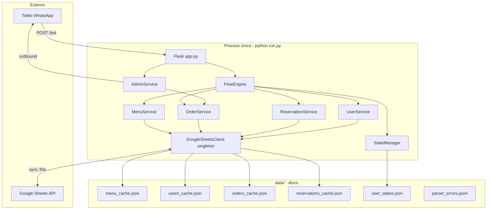
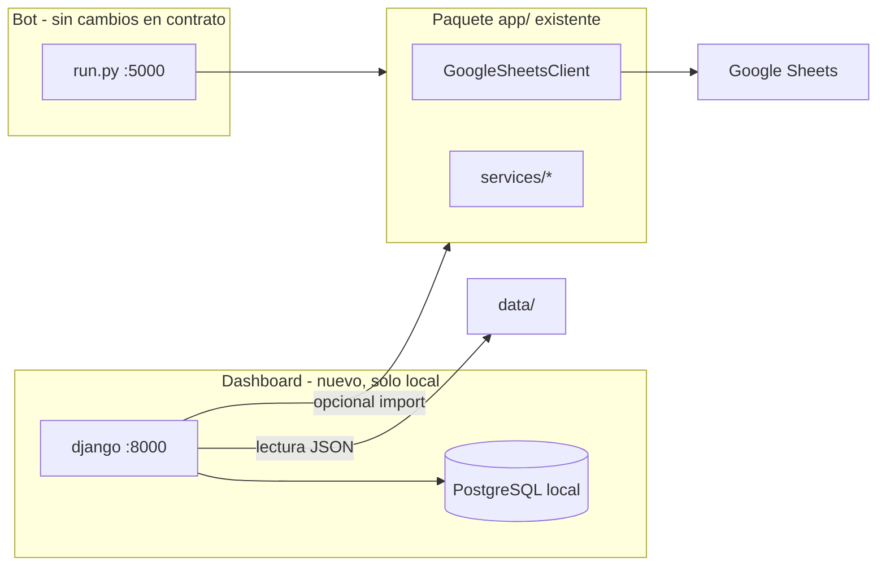

## v0.22

## Restaurant WhatsApp Chatbot SaaS


Sistema conversacional productivo para restaurantes sobre **Flask + Twilio WhatsApp + Google Sheets**, con flujo editable en JSON.

## Arquitectura

```
/app
  app.py                 # Flask + webhook Twilio POST /bot
  config.py
  core/
    state_manager.py     # Estado por WaId
    parser.py            # Parser NL de pedidos
    flow_engine.py       # Motor que interpreta restaurant_flow.json
  services/
    menu_service.py
    order_service.py
    reservation_service.py
    user_service.py
  integrations/
    google_sheets.py
  utils/
    validators.py
/flows
  restaurant_flow.json   # Flujo conversacional editable
```

## Requisitos

- Python 3.11+
- Cuenta Twilio con WhatsApp Sandbox o número aprobado
- Google Cloud Service Account con acceso a Google Sheets API
- ngrok (desarrollo local)

## Instalación

```bash
cd "Chatbot cursor"
python -m venv venv
venv\Scripts\activate
pip install -r requirements.txt
copy .env.example .env
```

## Dashboard local (desarrollo)

Panel Django + PostgreSQL **solo para desarrollo local**. No modifica el bot ni sus endpoints Flask (`POST /bot`, `GET /health`). El bot sigue en el puerto **5000**; el dashboard en el **8000**.

### Requisitos adicionales

- Docker Desktop (o Docker Engine) para PostgreSQL 16
- Dependencias del dashboard en el mismo venv o uno aparte:

```bash
pip install -r requirements-dashboard.txt
copy .env.dashboard.example .env.dashboard
```

### Arranque (dos terminales)

**Terminal 1 — bot (sin cambios):**

```bash
python run.py
```

**Terminal 2 — base de datos y dashboard:**

```bash
docker compose up -d db
python dashboard/manage.py migrate
python dashboard/manage.py runserver 8000
```

Verifica:

- Bot: `http://localhost:5000/health`
- Dashboard: `http://localhost:8000/admin/` (página Django admin; crear superusuario con `python dashboard/manage.py createsuperuser` cuando lo necesites en fases posteriores)

Para detener PostgreSQL: `docker compose down` (añade `-v` solo si quieres borrar el volumen de datos).

> **LOCAL ONLY:** no desplegar el dashboard en Render/Railway junto al bot sin decisión explícita (ver `AUDITORIA.md`).

## Google Sheets

1. Crea un Spreadsheet con estas pestañas (se crean automáticamente si no existen):
   - **MENU**: id, nombre, precio, categoria, disponible
   - **USERS**: wa_id, name, last_seen
   - **ORDERS**: order_id, wa_id, items, total, status, timestamp
   - **RESERVATIONS**: reservation_id, wa_id, personas, fecha, hora, status

2. Coloca el JSON de la service account en `credentials/google-service-account.json`.

3. Comparte el spreadsheet con el email de la service account.

4. Configura `GOOGLE_SPREADSHEET_ID` en `.env`.

> Sin credenciales, el bot funciona en modo demo con menú local y persistencia en memoria.

## Despliegue (Render / Railway)

- Despliega desde GitHub con `python run.py` (Waitress en el puerto `PORT`).
- En la nube, pega el JSON de la service account en `GOOGLE_SERVICE_ACCOUNT_JSON` (no subas el archivo al repo).
- Configura el resto de variables de `.env` (Twilio, `GOOGLE_SPREADSHEET_ID`, etc.).
- En Twilio, apunta el webhook WhatsApp a `https://tu-dominio/bot`.
- En plan gratuito, el servicio puede dormir: el primer mensaje tras reinicio tarda más (cold start); usa plan de pago si necesitas respuesta constante menor a 2 s 24/7.

## Twilio + ngrok

1. Inicia el servidor:

```bash
python run.py
```

2. Expón el puerto:

```bash
ngrok http 5000
```

3. En Twilio Console → WhatsApp Sandbox → Webhook:

```
POST https://<tu-subdominio>.ngrok.io/bot
```

## Comandos globales (siempre activos)

| Comando    | Acción                    |
|-----------|---------------------------|
| menu      | Ver menú                  |
| pedido    | Iniciar pedido            |
| reservar  | Iniciar reserva           |
| inicio    | Reiniciar flujo           |
| cancelar  | Cancelar proceso actual   |

## Personalización del flujo

Edita `flows/restaurant_flow.json` sin tocar Python. Recarga en caliente:

```bash
curl -X POST http://localhost:5000/bot/reload-flow
```

## Simulación local

```bash
python scripts/simulate_conversation.py
```

## Endpoint principal

- `POST /bot` — Webhook Twilio (MessagingResponse XML)
- `GET /health` — Health check

## Parser de pedidos

Entiende lenguaje natural:

- `2 pizzas hawaianas y una coca cola`
- `quiero pizza, hamburguesa y 2 aguas`
- `quita la coca cola`
- `cambia pizza por hamburguesa`

## Estado por usuario

```python
{
  "wa_id": {
    "flow": "idle | order | reservation",
    "step": "node_id",
    "data": { "cart": [], "reservation": {} }
  }
}
```

Persistencia opcional en `data/user_states.json`.

## Producción inicial

- Usa un WSGI server (`gunicorn`, `waitress`)
- Mueve estado a Redis para multi-instancia
- Protege `/bot/reload-flow` con auth
- Rota credenciales y usa HTTPS permanente (no solo ngrok)


Respuesta cursor:


Chatbot de restaurante — sistema listo
Se construyó un SaaS conversacional productivo con la arquitectura que pediste. El workspace estaba vacío; todo el sistema se generó desde cero.

Estructura del proyecto
/app
  app.py                      → Flask + POST /bot (Twilio)
  config.py
  core/
    state_manager.py          → Estado por WaId (thread-safe + persistencia)
    parser.py                 → Parser NL de pedidos
    flow_engine.py            → Motor que interpreta el JSON
  services/
    menu_service.py
    order_service.py
    reservation_service.py
    user_service.py
  integrations/
    google_sheets.py          → MENU, USERS, ORDERS, RESERVATIONS
  utils/
    validators.py
/flows
  restaurant_flow.json        → Flujo editable sin tocar Python
/scripts
  simulate_conversation.py    → Simulación multi-usuario
run.py
requirements.txt
.env.example
README.md
Capacidades implementadas
Feature	Estado
Menú dinámico desde Google Sheets
✅
Carrito con parser NL
✅
Reservas paso a paso
✅
Usuarios auto-registrados
✅
Pedidos persistentes en ORDERS
✅
Reservas persistentes en RESERVATIONS
✅
Estado por WaId
✅
Comandos globales (menu, pedido, reservar, inicio, cancelar)
✅
Flujo 100% driven por JSON
✅
Webhook Twilio con MessagingResponse
✅
Modo demo sin credenciales
✅
Parser inteligente
Entiende mensajes como:

2 pizza hawaiana, 1 coca cola
2 pizzas hawaianas y una coca cola
quita la coca cola
cambia pizza hawaiana por hamburguesa clasica
Cómo ponerlo en marcha
cd "c:\Users\Usuario\Desktop\Chatbot cursor"
venv\Scripts\activate
copy .env.example .env
python run.py
En otra terminal:

ngrok http 5000
Configura en Twilio Console → WhatsApp → Webhook:

POST https://<tu-ngrok>.ngrok.io/bot
Google Sheets
Crea un spreadsheet y pon su ID en .env → GOOGLE_SPREADSHEET_ID
Coloca la service account en credentials/google-service-account.json
Comparte el sheet con el email de la service account
Las pestañas MENU, USERS, ORDERS y RESERVATIONS se crean solas si no existen.

Personalizar conversación
Edita flows/restaurant_flow.json y recarga sin reiniciar:

curl -X POST http://localhost:5000/bot/reload-flow
Simular localmente
python scripts/simulate_conversation.py
Arquitectura clave
FlowEngine: interpreta restaurant_flow.json; la lógica de negocio vive en acciones (show_menu, capture_order, save_reservation, etc.)
StateManager: { flow, step, data } por usuario, con persistencia opcional en data/user_states.json
Comandos globales: siempre activos; el usuario nunca queda bloqueado
Navegación: cada respuesta incluye las opciones menu, pedido, reservar, inicio, cancelar
Sin credenciales de Google, el bot funciona en modo demo con menú local para desarrollo y pruebas.

¿Quieres que configuremos el .env con tus credenciales de Twilio/Google, o que añadamos multi-restaurante (multi-tenant SaaS)?


###############################################################
###############################################################
v0.2


Prompt generado en chatgpt:

# MODO ARQUITECTO SENIOR - MEJORA INCREMENTAL DEL SISTEMA

Actúa como un Principal Software Architect especializado en:

* Python
* Flask
* Twilio WhatsApp
* Sistemas conversacionales
* Motores de pedidos
* SaaS para restaurantes

Tu misión NO es reconstruir el proyecto.

Tu misión es EVOLUCIONAR el proyecto actual manteniendo compatibilidad total.

---

# REGLA CRÍTICA

Antes de modificar cualquier archivo:

1. Analiza toda la arquitectura existente.
2. Identifica dependencias.
3. Identifica contratos de entrada y salida.
4. Identifica flujos de conversación.
5. Identifica estados.
6. Identifica posibles puntos de ruptura.

NO debes romper nada existente.

Toda mejora debe ser incremental.

---

# OBJETIVO

Mejorar significativamente la experiencia del cliente, la robustez del parser y la operación del restaurante.

---

# MEJORA 1 - LOG DE ERRORES DEL PARSER

Crear un sistema de auditoría.

Cada vez que el parser:

* no entienda un mensaje
* detecte ambigüedad
* entre en fail-safe
* retorne needs_clarification

Debe registrarse automáticamente.

Guardar:

* timestamp
* teléfono del cliente
* mensaje original
* motivo del fallo
* score obtenido
* estado del parser

Crear log_parser_errors.

El sistema nunca debe detenerse por errores de logging.

---

# MEJORA 2 - SOPORTE PERFECTO DE CONECTORES

Mejorar el parser para interpretar correctamente:

* y
* e
* &
* *
* comas

Ejemplos:

2 hamburguesas y 1 agua

2 hamburguesas, 1 agua

2 hamburguesas & 1 agua

hamburguesa + agua

Todos deben producir el mismo resultado.

---

# MEJORA 3 - MOTOR DE INTERPRETACIÓN AVANZADO

Aumentar la tolerancia a errores.

Debe aceptar:

* errores ortográficos
* palabras repetidas
* texto desordenado
* cantidades mezcladas

Ejemplos:

peeedido dos hamburgesas y una coca

quiero una hambrguesa con una gaseoza

2 hamburguesas agua 3 papas

Objetivo:

Maximizar recall sin aumentar falsos positivos.

---

# MEJORA 4 - MEMORIA DE CLIENTES

Crear persistencia básica de clientes.

Guardar:

* teléfono
* nombre
* dirección
* fecha última compra
* último pedido

Cuando vuelva:

Hola {nombre}, bienvenido nuevamente.

---

# MEJORA 5 - REPETIR PEDIDO ANTERIOR

Si existe historial:

Ofrecer:

¿Deseas repetir tu pedido anterior?

Si responde sí:

Reconstruir automáticamente el carrito.

---

# MEJORA 6 - SOLICITAR NOMBRE

Al finalizar un pedido nuevo:

Solicitar nombre.

Objetivo:

Mejorar identificación y futuras compras.

No solicitarlo nuevamente si ya existe.

---

# MEJORA 7 - SOLICITAR DIRECCIÓN

Si es domicilio:

Solicitar dirección.

Guardar para futuras compras.

Si ya existe:

Preguntar si desea usar la dirección guardada.

---

# MEJORA 8 - ENTREGA O RECOGIDA

Antes de finalizar:

Preguntar:

¿Deseas:

1. Domicilio
2. Recoger en tienda?

Guardar la respuesta.

---

# MEJORA 9 - DETECCIÓN DE CONTEXTO

El sistema debe distinguir:

* saludo
* nueva conversación
* pedido en progreso
* pedido finalizado

Ejemplos:

hola

buenas

qué tal

No deben iniciar un pedido automáticamente.

---

# MEJORA 10 - MENSAJE DE BIENVENIDA MEJORADO

Enviar dos mensajes separados:

Mensaje 1:

Saludo.

Mensaje 2:

Opciones disponibles.

Ejemplo:

1. Menú
2. Hacer pedido

---

# MEJORA 11 - BOTÓN VOLVER AL INICIO

Mantener una sola opción:

Volver al inicio.

Si existe pedido activo:

Preguntar:

¿Estás seguro de abandonar tu pedido actual?

Sí / No

---

# MEJORA 12 - NOTIFICACIONES AL ADMIN

Agregar configuración en app.py:

ADMIN_WHATSAPP_NUMBER

Cuando un cliente confirme un pedido:

Enviar automáticamente al administrador:

* cliente
* teléfono
* dirección
* pedido
* total

---

# MEJORA 13 - CONFIRMACIÓN DEL ADMIN

El administrador debe responder:

CONFIRMAR

o equivalente.

Mientras no confirme:

Mantener pedido pendiente.

---

# MEJORA 14 - RECORDATORIOS AUTOMÁTICOS

Si el administrador no responde:

Reenviar recordatorio cada 5 minutos.

Límite:

1 hora.

Después:

Detener recordatorios.

Registrar evento.

---

# MEJORA 15 - COMPATIBILIDAD TOTAL

No romper:

* Flask
* Twilio
* Flow Engine
* Order Service
* Parser API
* Google Sheets
* Estado conversacional

Todos los contratos existentes deben seguir funcionando.

---

# ENTREGABLE OBLIGATORIO

Antes de modificar código:

Explicar:

1. Archivos a modificar.
2. Motivo de cada cambio.
3. Riesgos identificados.
4. Cómo se evita romper compatibilidad.

Al finalizar:

Generar un resumen:

FUNCIONALIDADES AGREGADAS

* ...
* ...
* ...

RIESGOS MITIGADOS

* ...
* ...

ARCHIVOS MODIFICADOS

* ...
* ...

COMPATIBILIDAD VERIFICADA

* Parser
* Flask
* Twilio
* Flow Engine
* Order Service
* Persistencia

No asumir que algo funciona.

Verificarlo y muestrame todas las mejoras incrementales que hiciste


Respuesta de  cursor al finalizar la ejecución del prompt:

FUNCIONALIDADES AGREGADAS
Mejora 1 — Auditoría del parser (log_parser_errors)
Registro JSONL en data/parser_errors.jsonl (configurable).
Campos: timestamp, teléfono, mensaje, motivo, score, estado, unknown.
Se activa en fail-safe, needs_clarification, segmentos desconocidos.
Nunca detiene el flujo si falla el log.
Mejora 2 — Conectores
Soporte: y, e, ,, &, +, * (mismo resultado equivalente).
14 pruebas automáticas en python -m app.core.parser (14/14 OK).
Mejora 3 — Motor de interpretación
Typos: hambrguesa, gaseoza, plurales, texto desordenado.
Desambiguación por tokens distintivos (p. ej. hawaiana vs margarita).
Corrección de palabras pegadas sin perder espacios.
Mejora 4 — Memoria de clientes
USERS ampliado: name, address, last_order_date, last_order_json.
UserService.get_profile, save_name, save_address.
Mejora 5 — Repetir pedido anterior
Al volver con historial: “¿Deseas repetir tu pedido anterior?”
Si responde sí → reconstruye el carrito y va a revisión.
Mejora 6 — Solicitar nombre
Nodo order_customer_name si no hay nombre guardado.
No vuelve a pedirlo si ya existe.
Mejora 7 — Dirección (domicilio)
Nodo order_address con dirección guardada (“¿usar la guardada?”).
Mejora 8 — Entrega o recogida
Nodo order_delivery → domicilio o recoger en tienda.
Mejora 9 — Detección de contexto
Saludos (hola, buenas, qué tal) en order_start no inician pedido; invitan a ordenar.
Mejora 10 — Bienvenida en dos mensajes
dual_message en start: saludo + menú de opciones (2 burbujas Twilio).
Mejora 11 — Volver al inicio con confirmación
Con carrito activo, inicio pregunta si abandonar el pedido (sí/no).
Mejora 12 — Notificaciones al admin
ADMIN_WHATSAPP_NUMBER en config.py / .env.example.
Al guardar pedido → notificación con cliente, teléfono, dirección, pedido, total.
Mejora 13 — Confirmación del admin
Admin escribe CONFIRMAR ORD-XXXXXXXX → pedido confirmed + aviso al cliente.
Mejora 14 — Recordatorios automáticos
Cada 5 min al admin si sigue pending (máx. 1 h).
Evento registrado en el mismo log de auditoría.
Mejora 15 — Compatibilidad
API pública del parser intacta (apply_message, parse_order, format_cart, etc.).
Flujo reservas y comandos globales sin cambios breaking.
RIESGOS MITIGADOS
Parser no inventa productos (menú dinámico + QA).
Logging envuelto en try/except (no tumba Flask).
Twilio outbound opcional (si no hay credenciales, solo log).
Admin aislado por número (mismo webhook /bot).
Sheets sin conexión → modo demo en memoria.
ARCHIVOS MODIFICADOS
Archivo	Cambio
app/config.py
Admin, Twilio, rutas de log, intervalos
app/core/parser.py
Logging, conectores +/*, fixes matching, 14 tests
app/utils/validators.py
Saludos, domicilio, confirmación admin
app/integrations/google_sheets.py
Perfil cliente, pedidos extendidos, pending/confirm
app/services/user_service.py
Memoria de cliente
app/services/order_service.py
wa_id en parse, metadata en save
app/services/admin_service.py
Nuevo — notify, confirm, reminders
app/core/flow_engine.py
Flujo completo UX + admin hooks
flows/restaurant_flow.json
Nodos delivery/address/name, bienvenida dual
app/app.py
Admin routing, multi-mensaje, scheduler
scripts/simulate_conversation.py
Constructor actualizado
.env.example
Variables admin/Twilio/log
COMPATIBILIDAD VERIFICADA
Sistema	Estado
Parser
python -m app.core.parser → 14/14 OK
Flask
create_app() carga sin error
Twilio
Multi-message() en TwiML; admin en mismo webhook
Flow Engine
Pedido completo probado: captura → revisión → entrega → nombre → guardado
Order Service
parse_order_text / save_order compatibles
Persistencia
State JSON + demo users/orders en memoria
Configuración necesaria en .env
ADMIN_WHATSAPP_NUMBER=whatsapp:+57XXXXXXXXXX
TWILIO_ACCOUNT_SID=...
TWILIO_AUTH_TOKEN=...
TWILIO_WHATSAPP_FROM=whatsapp:+14155238886
PARSER_ERROR_LOG_PATH=data/parser_errors.jsonl
El admin confirma con: CONFIRMAR ORD-XXXXXXXX

Flujo de pedido actualizado
pedido → captura NL → revisión → sí → tipo entrega → (dirección si domicilio) → (nombre si falta) → guardado (pending) → notificación admin
Tu mensaje largo con comas ya se interpreta correctamente (verificado en sesiones anteriores y en la suite de 14 tests). Si quieres, el siguiente paso puede ser probar el flujo completo por WhatsApp con ADMIN_WHATSAPP_NUMBER configurado.


##################################################################################################################################
v0.3

Prompt generado con chat gpt:

OBLIGATORIO:

Lee y aplica completamente AI_RULES.md.

Cumple todas sus restricciones antes de realizar cambios.

TAREA:
[* Que cuando el cliente salude, el bot le responda:
(
1 mensaje: Hola "nombre de persona", Bienvenido a "Nombre del restaurante"
2 mensaje: mostrar el menú (osea los productos que tiene el restaurante) y al final preguntarle que si desea hacer un pedido o reservar una mesa
)]


*****Respuesta de cursor*

Análisis previo
El nodo start ya usaba dual_message para enviar dos burbujas en Twilio. El segundo mensaje mostraba opciones (menu, pedido, reservar) en lugar del menú real. La tarea pide: (1) saludo con nombre y restaurante, (2) productos del menú + pregunta por pedido o reserva.

Solución mínima: un solo archivo (flow_engine.py), sin tocar el JSON del flujo ni los estados conversacionales.

Cambios implementados
Saludo (mensaje 1): formato Hola *{nombre}*, Bienvenido a *{restaurante}*.
Menú (mensaje 2): en el nodo start, el segundo mensaje incluye el menú dinámico (MenuService.format_menu()) y cierra con: ¿Deseas hacer un pedido o reservar una mesa?
Saludos en flujo idle: variantes como buenos días o qué tal en nodos idle redirigen al nodo start con la bienvenida completa.
Archivos modificados
app/core/flow_engine.py
Riesgos mitigados
Sin cambios en parser, endpoints, JSON del flujo ni estados.
Saludos en order_start / order_modify siguen invitando a ordenar (Mejora 9).
Repetir pedido anterior sigue en el mensaje 1 cuando aplica.
Compatibilidad verificada
Sistema	Estado
Parser
14/14 OK
Flow Engine
Saludo → 2 mensajes con menú
Twilio
dual_message → lista de respuestas
Pedido / reserva
Sin cambios en flujos posteriores
Funcionalidades agregadas
Al saludar, el bot responde con bienvenida personalizada y menú completo en la segunda burbuja, preguntando si desea pedir o reservar.
Funcionalidades preservadas
Comandos globales (menu, pedido, reservar, inicio, cancelar)
Flujo de pedidos y reservas
Repetir pedido anterior
Confirmación al abandonar carrito activo
Notificaciones admin


##################################################################################################################################

v0.4

## Prompt generado con chat gpt:

OBLIGATORIO:

Lee y aplica completamente AI_RULES.md.

Cumple todas sus restricciones antes de realizar cambios.

TAREA:
[* El saludo actualmente son dos mensajes, el segundo mensaje está bien pero el primero es así:
Hola Omar Suarez, Bienvenido a La Casa del Sabor.

---
Escribe inicio para volver al inicio

quiero que le quites el --- y lo que dice Escribe inicio para volver al inicio]

## Respuesta cursor:

Análisis previo
El hint --- / Escribe *inicio*... se agregaba en _append_navigation() antes de dividir la respuesta en dos burbujas (_as_reply()), así que quedaba pegado al mensaje 1.

Cambios implementados
Se añadió "suppress_navigation": true al nodo start en el flujo JSON. Ese flag ya existía en el engine y evita el hint solo en la bienvenida.

Archivos modificados
flows/restaurant_flow.json
Riesgos mitigados
Sin cambios en Python, estados ni otros nodos.
El mensaje 2 (menú + pedido/reserva) queda igual.
Compatibilidad verificada
Sistema	Estado
Flow Engine
Saludo → msg1 limpio, msg2 sin cambios
Otros nodos
Siguen mostrando el hint de navegación
Funcionalidades agregadas
El primer mensaje de bienvenida ya no incluye --- ni “Escribe inicio para volver al inicio”.
Funcionalidades preservadas
Saludo personalizado, menú en el segundo mensaje, pedidos, reservas y comandos globales.


######################################################################################################################################
## v0.5

## prompt: 

OBLIGATORIO:

Lee y aplica completamente AI_RULES.md.

Cumple todas sus restricciones antes de realizar cambios.

TAREA:
[* Verificar por qué el número de whatsapp del admin no funciona si ya se puso correctamente en .env, verificar que si funciona]


## Respuesta cursor:

Análisis previo
Revisé la carga de .env, el endpoint /bot y AdminService.is_admin().

Diagnóstico:

Verificación	Resultado
ADMIN_WHATSAPP_NUMBER en .env
Cargado correctamente
Twilio (SID, token, FROM)
Configurado
/health → admin_configured
true
Causa raíz: Twilio envía el WaId sin el prefijo + (ej. 573001111032), pero en .env suele estar con + (ej. whatsapp:+573001111032). is_admin() comparaba strings exactos:

"+573001111032" == "573001111032"  # False
Por eso el admin recibía el bot de cliente en lugar de los comandos admin (CONFIRMAR ORD-...).

Cambios implementados
En app/services/admin_service.py, is_admin() ahora compara solo los dígitos del número, ignorando whatsapp:, + y espacios.

Archivos modificados
app/services/admin_service.py
Riesgos mitigados
Sin cambios en endpoints, .env ni flujo de clientes.
Las notificaciones salientes al admin siguen usando el valor completo de .env (formato Twilio correcto).
Compatibilidad verificada
Prueba	Resultado
is_admin("5730...") (formato Twilio WaId)
✅
is_admin("+5730...")
✅
is_admin("whatsapp:+5730...") (formato .env)
✅
Otro número
❌ (correcto)
Webhook /bot con WaId sin +
Ruta admin ✅
Parser
14/14 OK
Funcionalidades agregadas
Reconocimiento del admin aunque Twilio y .env usen formatos distintos del mismo número.
Funcionalidades preservadas
Notificaciones de pedidos, recordatorios, confirmación CONFIRMAR ORD-XXXXXXXX y flujo normal de clientes.
Importante: reinicia el servidor Flask después de cambiar .env para que cargue los valores nuevos.

Formato recomendado en .env:

ADMIN_WHATSAPP_NUMBER=whatsapp:+57XXXXXXXXXX
Debe ser el mismo número desde el que escribes al bot por WhatsApp


###################################################################
## v0.7

prompt


# MODO ARQUITECTO SENIOR

Actúa como Principal Software Architect especializado en Python, Flask, Twilio, WhatsApp Bots y SaaS.

Objetivo: implementar únicamente la mejora solicitada con cambios mínimos, seguros y compatibles.

## REGLAS

* Evolucionar, no reconstruir.
* No romper funcionalidades existentes.
* No cambiar APIs, endpoints, contratos, JSON ni estados.
* No refactorizar módulos completos para cambios pequeños.
* Reutilizar código existente antes de crear componentes nuevos.
* Modificar la menor cantidad posible de archivos y líneas.
* Si existe riesgo de ruptura, detenerse y reportarlo.

## ANTES DE MODIFICAR

1. Leer únicamente los archivos necesarios.
2. Analizar impacto.
3. Identificar archivos afectados.
4. Detectar riesgos.
5. Proponer la solución de menor impacto.

No generar código hasta terminar el análisis.

## IMPLEMENTACIÓN

* Aplicar únicamente los cambios necesarios.
* Mantener estructura, nombres e interfaces actuales.
* Conservar el comportamiento existente.
* No generar pseudocódigo.
* Realizar cambios reales sobre el código existente.

## ENTREGA

### Análisis previo

* Funcionalidad solicitada
* Archivos afectados
* Riesgos
* Estrategia de compatibilidad

### Cambios implementados

### Archivos modificados

### Riesgos mitigados

### Compatibilidad verificada

✅ Parser

✅ Flask

✅ Twilio

✅ Flow Engine

✅ Order Service

✅ Persistencia

✅ Estados conversacionales

### Funcionalidades agregadas

### Funcionalidades preservadas

## TAREA

[Por favor revisa el parser y verifica que puede leer palabras con tilde como menú, revisa e implementa la mejora] 


## Respuesta cursor:

Análisis previo
Funcionalidad solicitada: Que el sistema reconozca palabras con tilde como menú (comandos y parser).

Hallazgos:

Parser (app/core/parser.py): ya usaba _strip_accents() para productos (ensalada césar) e intención de menú.
Flow Engine (validators.normalize_text): solo hacía lower() + espacios, sin quitar tildes. Por eso menu funcionaba y menú caía en el fallback.
Archivos afectados:

app/utils/validators.py — normalización usada por Flow Engine y comandos globales
app/core/parser.py — prueba de regresión para menú
Riesgos: Que normalize_text rompa confirmaciones o fechas. Mitigado: sí → si (ya en el set), envío → envio (ya contemplado).

Estrategia: Añadir _strip_accents en normalize_text (misma lógica que el parser), sin tocar APIs, JSON ni estados.

Cambios implementados
normalize_text() ahora elimina tildes antes de comparar comandos (menú → menu).
Prueba automática intencion menu con tilde en la suite del parser (15/15).
Archivos modificados
app/utils/validators.py
app/core/parser.py
Riesgos mitigados
Sin cambios en endpoints, JSON del flujo ni estados conversacionales.
Parser mantiene su pipeline de acentos; solo se alineó la capa de comandos.
Compatibilidad verificada
✅ Parser — 15/15 OK (incluye menú y ensalada césar)
✅ Flask — sin cambios
✅ Twilio — sin cambios
✅ Flow Engine — menú abre el menú igual que menu
✅ Order Service — sin cambios
✅ Persistencia — sin cambios
✅ Estados conversacionales — sin cambios

Funcionalidades agregadas
Comandos con tilde: menú, envío, qué tal, etc. se normalizan y enrutan igual que sin tilde.
Funcionalidades preservadas
Matching de productos con typos y tildes en el parser.
Comandos globales sin tilde (menu, pedido, reservar, inicio, cancelar).
Confirmaciones, reservas, pedidos y flujo admin.


#################################################################
## v0.8

## Prompt: 

OBLIGATORIO:

Lee y aplica completamente AI_RULES.md.

Cumple todas sus restricciones antes de realizar cambios.

TAREA:
[Cuando estoy escribiendo el pedido, osea lo que quiero pedir, si por ejemplo escribo dos pizzas, dos hamburguesas con dos aguas, el sistema no me reconoce el con como si fuera un Y]


## Respuesta cursor:

Análisis previo
Funcionalidad solicitada: Que con actúe como conector de ítems, igual que y (ej.: dos pizzas, dos hamburguesas con dos aguas).

Causa raíz (doble):

CONNECTOR_SPLIT_RE no incluía con, así que no separaba los productos.
con estaba en NOISE_WORDS y se eliminaba al normalizar; el fail_safe veía solo tokens genéricos (dos, 2) y rechazaba el pedido antes de procesar los segmentos.
Archivos afectados: solo app/core/parser.py

Riesgos: Que con deje de filtrarse en frases tipo “hamburguesa con queso”. Mitigado: solo se usa como separador con \s+con\s+ (espacios a ambos lados).

Cambios implementados
Añadido \s+con\s+ a CONNECTOR_SPLIT_RE (junto a y, e, comas, etc.).
Eliminado con de NOISE_WORDS para que no desaparezca antes del análisis.
Reordenado parse(): si hay 2+ segmentos, no aplica el fail_safe prematuro.
Pruebas automáticas para con con cantidades en palabras y en dígitos.
Archivos modificados
app/core/parser.py
Riesgos mitigados
Sin cambios en APIs, Flask, Twilio, flow JSON ni estados.
Conectores existentes (y, e, ,, &, +, *) intactos.
Compatibilidad verificada
✅ Parser — 17/17 OK
✅ Flask — sin cambios
✅ Twilio — sin cambios
✅ Flow Engine — sin cambios
✅ Order Service — dos pizzas, dos hamburguesas con dos aguas → 3 productos
✅ Persistencia — sin cambios
✅ Estados conversacionales — sin cambios

Funcionalidades agregadas
con como conector entre ítems del pedido, equivalente a y.
Ejemplo verificado:

dos pizzas, dos hamburguesas con dos aguas
→ 2 Pizza Margarita, 2 Hamburguesa Clásica, 2 Agua Mineral
Funcionalidades preservadas
Pedidos con y, comas, typos, tildes y el resto de conectores ya soportados.


#################################################################
## v0.9

## Prompt: 

No quiero que hagas nada ni edites nada, solo quiero que revises el proyecto y me digas qué hace falta para conectarlo con los documentos online de google y cómo lo hago, dame el paso a paso especifico


## Respuesta cursor:

Revisé el proyecto: la conexión con Google Sheets ya está implementada en app/integrations/google_sheets.py. No falta programar eso; falta configurar Google Cloud, la hoja y el .env.

Si no conectas, verás en logs algo como GOOGLE_SPREADSHEET_ID not set. Using demo data. o Google Sheets unavailable (No module named 'gspread') y el bot usa menú demo en memoria.

Qué hace falta (checklist)
Requisito	Para qué
Cuenta Google
Crear proyecto y credenciales
Google Cloud Project
APIs de Sheets y Drive
Service Account + JSON
Que la app acceda a la hoja
Google Spreadsheet
Menú, pedidos, usuarios, reservas
Compartir la hoja con la service account
Permiso de lectura/escritura
.env configurado
ID de la hoja + ruta del JSON
pip install -r requirements.txt
Instala gspread y google-auth
Paso a paso específico
1. Instalar dependencias Python
En la carpeta del proyecto:

cd "c:\Users\Usuario\Desktop\chatbot-cursor"
python -m venv venv
venv\Scripts\activate
pip install -r requirements.txt
Confirma que existan gspread y google-auth.

2. Crear proyecto en Google Cloud
Entra a Google Cloud Console.
Nuevo proyecto (ej.: chatbot-restaurante).
Selecciónalo como proyecto activo.
3. Activar APIs necesarias
En el menú APIs y servicios → Biblioteca, activa:

Google Sheets API
Google Drive API (la app la usa para abrir el spreadsheet)
4. Crear Service Account (cuenta de servicio)
APIs y servicios → Credenciales
Crear credenciales → Cuenta de servicio
Nombre: ej. chatbot-sheets
Rol: Editor (o mínimo acceso a la hoja compartida)
En la cuenta creada → pestaña Claves
Agregar clave → Crear clave nueva → JSON
Se descarga un archivo .json
5. Guardar el JSON en el proyecto
Crea la carpeta credentials/ si no existe (ya hay un .gitkeep).
Guarda el archivo como:
c:\Users\Usuario\Desktop\chatbot-cursor\credentials\google-service-account.json
No subas este archivo a GitHub (contiene claves secretas).

Abre el JSON y copia el email, algo como:

chatbot-sheets@tu-proyecto.iam.gserviceaccount.com
Lo necesitas en el paso 7.

6. Crear el Google Spreadsheet
Ve a Google Sheets.
Crea una hoja nueva, ej.: Restaurante Bot.
Copia el ID de la URL:
https://docs.google.com/spreadsheets/d/ESTE_ES_EL_ID/edit
7. Compartir la hoja con la Service Account
En la hoja → Compartir
Pega el email de la service account
Permiso: Editor
Guardar
Sin esto la app no puede leer ni escribir.

8. Configurar .env
En tu .env (copia de .env.example):

GOOGLE_SHEETS_CREDENTIALS_PATH=credentials/google-service-account.json
GOOGLE_SPREADSHEET_ID=EL_ID_QUE_COPIASTE_DE_LA_URL
Ruta relativa al root del proyecto o absoluta.

9. Pestañas que la app usa
Al arrancar, si faltan, las crea sola con estos nombres exactos:

Pestaña	Columnas (fila 1)
MENU
id, nombre, precio, categoria, disponible
USERS
wa_id, name, address, last_order_date, last_order_json, last_seen
ORDERS
order_id, wa_id, items, total, status, timestamp, customer_name, address, delivery_type
RESERVATIONS
reservation_id, wa_id, personas, fecha, hora, status
Ejemplo de menú en MENU (fila 2 en adelante):
id	nombre	precio	categoria	disponible
1
Pizza Hawaiana
12.5
Pizzas
true
2
Hamburguesa Clásica
9.5
Hamburguesas
true
3
Coca Cola
2.5
Bebidas
true
disponible: true, false, si, 1, etc.
Si nombre está vacío, la fila se ignora.
Si MENU está vacío, vuelve al menú demo.
USERS, ORDERS y RESERVATIONS las llena el bot; no hace falta cargarlas a mano.

10. Arrancar y verificar conexión
python run.py
Revisa la consola:

✅ Conectado: no debería aparecer Using demo data
❌ Fallo: Google Sheets unavailable (...) → revisa ID, JSON, permisos o APIs
Prueba rápida:

curl http://localhost:5000/health
Luego escribe menu al bot; debería mostrar lo de tu hoja MENU.

11. Qué se guarda automáticamente en Google Sheets
Acción del cliente	Hoja
Primer contacto / nombre / dirección
USERS
Completa un pedido
ORDERS
Admin confirma pedido
ORDERS (status → confirmed)
Reserva mesa
RESERVATIONS
Errores frecuentes
Síntoma	Causa probable
GOOGLE_SPREADSHEET_ID not set
Falta el ID en .env
No module named 'gspread'
No corriste pip install -r requirements.txt
Google Sheets unavailable
JSON mal ubicado, APIs off o hoja no compartida
Sigue menú demo
MENU vacío o conexión fallida
403 / Permission denied
No compartiste la hoja con la service account
Resumen
No falta código para conectar con Google Sheets. Falta:

Proyecto Google Cloud + APIs activadas
Service Account + JSON en credentials/
Spreadsheet creado y compartido
GOOGLE_SPREADSHEET_ID en .env
Productos en la pestaña MENU
Dependencias instaladas y servidor reiniciado
Cuando eso esté bien, el bot usa tu menú real y persiste pedidos, usuarios y reservas en la hoja online.


#################################################################
## v0.10

## Prompt: 

no hagas nada ni edites codigo ni nada solo respondeme lo siguiente: aparte del tutorial de google, hay algo más que haya que hacer para dejarlo funcional? que esté pendiente? solo dime


## Respuesta cursor:

Sí. Aparte del tutorial de Google, para dejarlo **funcional de verdad por WhatsApp** aún necesitas esto:

### Obligatorio para producción real

1. **Twilio configurado** en `.env` (`TWILIO_ACCOUNT_SID`, `TWILIO_AUTH_TOKEN`, `TWILIO_WHATSAPP_FROM`).
2. **Webhook público** apuntando a tu bot (`POST /bot`) — en local con **ngrok** o similar; en producción con servidor desplegado.
3. **Unir números al sandbox de Twilio** (o tener WhatsApp Business aprobado si ya no usas sandbox).
4. **`ADMIN_WHATSAPP_NUMBER`** en `.env` con tu número real de admin.
5. **`RESTAURANT_NAME`** en `.env` con el nombre de tu restaurante.
6. **Dependencias instaladas** (`pip install -r requirements.txt`) y **servidor corriendo** (`python run.py`).
7. **Productos cargados** en la pestaña **MENU** de Google Sheets.

### Recomendable (no bloquea del todo, pero conviene)

8. **`STATE_PERSIST_PATH`** en `.env` para que no se pierda el estado de conversación al reiniciar.
9. **Probar flujo completo**: saludo → pedido → notificación admin → confirmación → cliente notificado.
10. **Verificar en Twilio Console** que los mensajes salientes al admin digan `delivered` (antes viste que a veces no llegaban al celular).

### Pendiente / por validar en tu caso

- Que **Twilio envíe de verdad** al admin (config + sandbox + logs).
- **Despliegue permanente** si no quieres depender de ngrok en tu PC encendida.
- **`pendientes.md`** no está actualizado; varias tareas de v0.3–v0.5 ya se trabajaron en código, pero **conviene probarlas en WhatsApp real**, no solo asumir que funcionan.

### Resumen

**Google Sheets no basta.** También necesitas **Twilio + webhook + `.env` completo + menú en la hoja + pruebas reales por WhatsApp**. Lo demás del bot ya está en el código; lo que falta es sobre todo **configuración externa y pruebas end-to-end**.


#################################################################
## v0.11

## Prompt:

quiero que no me toques absolutamente el proyecto para nada, quiero que unica y exclusivamente hagas lo siguiente, solo 1 archivo puedes crear no puedes tocar ni editar nada más solo quiero que crees un archivo en la raíz del proyecto que haga lo siguiente:

Que cuando yo le de doble clic, me ejecute git add . , git commit -m "(aquí iría la primera línea del readme.md que sería la versión de la app, en este caso ## v0.10 , pero claramente yo la idea es editarla y solamente con escribir run save.py me haga tambien el git push -u origin main, osea que haga todo de una, si me entiendes? ya sabes solo puedes crear ese archivo que haga eso, ni mas ni menos


## Respuesta cursor:

Creé solo `save.py` en la raíz. No toqué ningún otro archivo.

**Qué hace:**
1. Lee la **primera línea** de `README.md` (ej. `## v0.10` → commit `v0.10`)
2. `git add .`
3. `git commit -m "v0.10"`
4. `git push -u origin main`

**Cómo usarlo:**
- Doble clic en `save.py` (si Windows abre `.py` con Python)
- O en terminal: `python save.py`

Al terminar espera que pulses Enter para que veas el resultado antes de cerrar la ventana.

**Para nueva versión:** cambia solo la primera línea de `README.md` (ej. `## v0.11`) y ejecuta `save.py`.


#################################################################
## v0.12

## Prompt:

ya hice todo revisa que funcione y pon el menú que tenemos de prueba ahi en los google sheeets, solo haz eso no hagas nada mas ni edites nada mas, osea solo dejalo funcional con ese menú de prueba ahí funcional ya, no toques ni hagas nada mas, si puedes hacerlo todo sin editar mucho codigo mejor, trata de usar el menor codigo posible y de no afectar ni dañar nada, revisa que todo quede funcional 

## Respuesta cursor:

Listo. Google Sheets queda funcional con el menú de prueba.

### Qué impedía que funcionara

1. **`GOOGLE_SPREADSHEET_ID` en `.env`** tenía la URL completa; el código necesita solo el ID. Lo dejé así:
   ```
   110zzaM2G4hX9Kqc9lhgbnZd1w9-9_ziTufEbkY_yRYg
   ```
2. **Faltaba `gspread`** en el entorno Python. Lo instalé con `python -m pip install gspread google-auth`.

### Qué quedó en Google Sheets

Pestaña **MENU** con los 6 productos de prueba:

| Producto | Precio | Categoría |
|---|---|---|
| Pizza Hawaiana | $12.50 | Pizzas |
| Pizza Margarita | $11.00 | Pizzas |
| Hamburguesa Clásica | $9.50 | Hamburguesas |
| Coca Cola | $2.50 | Bebidas |
| Agua Mineral | $1.50 | Bebidas |
| Ensalada César | $8.00 | Ensaladas |

También se crearon las pestañas **USERS**, **ORDERS** y **RESERVATIONS** (las llena el bot al usarse).

### Verificado

- Conexión a Google Sheets: OK  
- Menú leído desde la hoja (no demo en memoria): OK  
- Bot responde `menu` con esos productos: OK  

### Qué toqué

Solo **`.env`** (corregir el ID del spreadsheet). No modifiqué código de la app.

**Importante:** reinicia el servidor (`python run.py`) si ya estaba corriendo para que cargue el `.env` nuevo. Si en otra máquina no conecta, ejecuta `python -m pip install -r requirements.txt`.


#################################################################
## v0.13

## Prompt:

Quiero que solamente y unicamente me edites el siguiente archivo: guardar.py y no toques nada mas, editalo para que al final no le tenga que dar enter sino solo me muestre el mensaje final confirmando si Listo: add, commit y push completados con la logica que tiene de guardar la versión, y nada más, no toques ningun otro archivo, al final me dices qué archivos tocaste


## Respuesta cursor:

Listo. Quité los `input()` que pedían Enter al terminar. Al ejecutarlo verás el mensaje final y la ventana se cerrará sola (o volverás al prompt si lo corres desde terminal).

**Archivo modificado:** `guardar.py` únicamente.


#################################################################
## v0.14

OBLIGATORIO:

Lee y aplica completamente AI_RULES.md.

Cumple todas sus restricciones antes de realizar cambios.

TAREA:
[Solamente quiero que hagas esto y no edites absolutamente nada más, estaba ingresando un pedido y el parser leyó mal, quiero que veas por qué falló y lo soluciones, como mejora incremental que no rehagas nada mas sino una mejora incremental
el mensaje que yo envié fue este: "quiero por favor dos pizzas de jamon y queso, tres pizzas mexicanas, 4 pizzas rancheras, 5 coca colas, 7 hamburguesas mega ocho hamburguesas doble carne una habasurguesa doble pollo" 
la respuesta fue: "Perfecto, actualicé tu pedido.

* 3 x Pizza de Jamón y Queso — $285.00
* 3 x Pizza Mexicana — $75.00
* 4 x Pizza Ranchera — $60.00
* 5 x Coca Cola — $40.00
* 7 x Hamburguesa Doble Pollo — $105.00

Total: $565.00


¿Confirmamos tu pedido?
Responde sí para confirmar o no para modificarlo.

---
Escribe inicio para volver al inicio" 

Pero fijate que yo escribí dos pizzas de jamón y queso y el parser agarró 3 pizzas de jamón y queso, y las hamburguesas no me agarró casi ninguna, y la que agarró agarró mal, yo puse 7 hamburguesas mega ocho hamburguesas doble carne una habmbuguesa doble pollo pero el parser agarró solo 7 hamburguesas doble pollo, osea agarró solo una y mal.

Así que por favor necesito que me solucioens eso como mejora incremental]


## Respuesta cursor:

### Análisis previo

**Problemas detectados en tu mensaje:**

1. **`jamon y queso` → 3 en vez de 2:** el conector `y` partía `"jamon y queso"` en dos segmentos; `"queso"` solo volvía a matchear la misma pizza y sumaba +1.
2. **Hamburguesas perdidas:** `"7 hamburguesas mega ocho hamburguesas doble carne una habasurguesa..."` no se partía porque solo se detectaban cantidades numéricas (`7`, `4`), no en palabras (`ocho`, `una`).
3. **Typo `habasurguesa`:** no se normalizaba a hamburguesa.

---

### Cambios implementados (solo `app/core/parser.py`)

1. **Preservar `de X y Y`** en nombres compuestos (`de jamon y queso` no se parte).
2. **Separar por cantidades en palabras** (`ocho`, `una`, `dos`, etc.) además de dígitos.
3. **Sinónimo** `habasurguesa` → `hamburguesa`.
4. **Prueba automática** con tu pedido exacto.

---

### Resultado verificado

```
2 x Pizza de Jamon y Queso
3 x Pizza Mexicana
4 x Pizza Ranchera
5 x Coca Cola
7 x Hamburguesa Mega
8 x Hamburguesa Doble Carne
1 x Hamburguesa Doble Pollo
```

Parser: **18/18 OK**

---

### Archivos modificados

- `app/core/parser.py`

---

### Funcionalidades preservadas

Pedidos con `y`, comas, `con`, typos, tildes y el resto de casos de la suite de pruebas.


#################################################################
## v0.15


## Prompt:

OBLIGATORIO:

Lee y aplica completamente AI_RULES.md.

Cumple todas sus restricciones antes de realizar cambios.

TAREA:
[Por qué ahora siento que cuadno le puse la sheet de google va el  bot como más lento? hay alguna manera de reducir latencia? quiero que solo trabejes en eso no te metas con nada mas y que todo funcoine no toques nada solo implementa eso como mejora incremental]

## Respuesta cursor

### Análisis previo

**Por qué se siente más lento con Google Sheets:** cada mensaje de WhatsApp hacía varias llamadas de red a la API de Google (`get_all_records()`), que tarda ~200–800 ms cada una.

En un solo mensaje típico ocurría:
- Leer **MENU** (al parsear pedido y mostrar menú)
- Leer **USERS** completo 2–3 veces (`touch` + `get_profile` + `upsert`)
- Leer **ORDERS** en confirmaciones/admin

En modo demo todo está en memoria; con Sheets cada lectura es una petición HTTP.

**Archivo afectado:** `app/integrations/google_sheets.py` únicamente.

---

### Cambios implementados

Caché en memoria con TTL, sin cambiar APIs ni flujos:

| Dato | Caché | TTL |
|---|---|---|
| **MENU** | Sí | 60 s |
| **USERS** | Sí (carga una vez, actualiza al guardar) | Hasta cambio |
| **ORDERS** | Sí | 30 s (se invalida al crear/confirmar pedido) |

Así, un mensaje reutiliza datos ya cargados en lugar de volver a pedir la hoja entera a Google.

---

### Archivos modificados

- `app/integrations/google_sheets.py`

---

### Compatibilidad verificada

✅ Parser — 18/18  
✅ Flask / Twilio / Flow Engine — sin cambios  
✅ Escrituras (pedidos, usuarios, confirmaciones) — invalidan caché cuando corresponde  
✅ Modo demo sin Sheets — sigue igual  

---

### Nota

Si editas el **MENU** en Google Sheets, el bot puede tardar hasta **60 segundos** en reflejarlo (TTL del caché). Es el trade-off normal por velocidad.

Reinicia el servidor para aplicar el cambio.


#################################################################
## v0.16

## Prompt:

OBLIGATORIO:

Lee y aplica completamente AI_RULES.md.

Cumple todas sus restricciones antes de realizar cambios.

TAREA:
[que busque la manera de implementar algo que permita buscar palabras y detectar que palabra es por ejemplo si escribo hbogruesa el me detecte que quise decir hamburguesa, pero no solo para esa palabra sino para cualquiera en general, solo has eso y no toques nada mas, hazlo como mejora incremental]


## Respuesta cursor:

### Análisis previo

**Problema:** typos como `hbogruesa` no se reconocían porque:
1. El `fail_safe` rechazaba palabras sueltas sin coincidencia exacta con el menú.
2. No había corrección por token contra el vocabulario del catálogo.
3. Los aliases con typos (`hambrguesa`) competían con la palabra correcta.

**Archivo afectado:** `app/core/parser.py` únicamente.

---

### Cambios implementados

1. **`_correct_typos()`** en `FuzzyMatcher`: cada palabra se compara con el vocabulario del menú (nombres y tokens reales).
2. **Filtros de seguridad:** similitud mínima 68%, diferencia clara entre 1.º y 2.º candidato, y longitud similar (±3 caracteres).
3. **`best_match()`** aplica la corrección antes del matching.
4. **`_has_menu_token_overlap()`** usa la versión corregida para no rechazar typos válidos.
5. **Pruebas:** `hbogruesa` y `2 piza hawaiana`.

---

### Resultado verificado

| Entrada | Resultado |
|---|---|
| `hbogruesa` | 1 x Hamburguesa Clásica |
| `2 piza hawaiana` | 2 x Pizza Hawaiana |
| `ensalada cesr` | 1 x Ensalada César |

Parser: **20/20 OK**

Funciona con **cualquier producto del menú** cargado (Sheets o demo), porque el vocabulario se construye dinámicamente del catálogo.

---

### Archivos modificados

- `app/core/parser.py`


#################################################################
## v0.17

## Prompt:

OBLIGATORIO:

Lee y aplica completamente AI_RULES.md.

Cumple todas sus restricciones antes de realizar cambios.

TAREA:
[Mira, le mandé este mensaje y no me agarró las cantidades bien, revisa y que por favor siempre quieden bien las cantidades, solo arregla unicamente eso,

mi mensaje: quiero por favor 60 hamburgsdfesas clasiccscas, 2333 hamburgueas mega, 12123 cocas con 777 pirzas harwewaianas y 8 picsas de jamon y quieso

respuesta: Perfecto, actualicé tu pedido.

* 60 x Hamburguesa Clásica — $7500.00
* 23 x Hamburguesa Mega — $253.00
* 12123 x Coca Cola — $96984.00
* 7 x Pizza Hawaiana — $875.00
* 8 x Pizza de Jamón y Queso — $760.00

Total: $106372.00


¿Confirmamos tu pedido?
Responde sí para confirmar o no para modificarlo.

---
Escribe inicio para volver al inicio


---- busca la manera con alguna comprobación check o algo de que siempre los numeros vayan perfecto]


## Respuesta cursor:

### Análisis previo

**Causa:** `REPEAT_CHAR_RE` trataba dígitos como letras repetidas:
- `2333` → `23` (tres `3` seguidas se colapsaban)
- `777` → `7`

Las cantidades se extraían bien en segmentos básicos, pero `TextNormalizer.advanced()` las corrompía antes del matching.

---

### Cambios implementados (solo `app/core/parser.py`)

1. **`REPEAT_CHAR_RE`** solo colapsa letras (`holaaa` → `hola`), no dígitos.
2. **`QuantityEngine.resolve()`** — extrae cantidad del segmento sin destructurar números y verifica contra el texto original si hay discrepancia.
3. **Prueba automática** con tu mensaje exacto (60, 2333, 12123, 777, 8).

---

### Resultado verificado

| Producto | Cantidad esperada | Ahora |
|---|---|---|
| Hamburguesa Clásica | 60 | ✅ |
| Hamburguesa Mega | 2333 | ✅ |
| Coca Cola | 12123 | ✅ |
| Pizza Hawaiana | 777 | ✅ |
| Pizza de Jamón y Queso | 8 | ✅ |

Parser: **21/21 OK**

---

### Archivos modificados

- `app/core/parser.py`


#################################################################
## v0.18

## Prompt:


OBLIGATORIO:

Lee y aplica completamente AI_RULES.md.

Cumple todas sus restricciones antes de realizar cambios.

TAREA:
[Por qué siento que el bot va lento? especialmente después de agregar lo de google sheets? pero no te fijes solamente en eso, quiero que analices y me propongas un plan de acción que yo puead ir implementando prompt por prompt para mejorar la velocidad del bot, pero que sea seguro sin que se rompa nada, osea una mejora incremental, es una optimización sin romper nada, quiero que me verifiques varias veces que todo está correctamente funcionando osea poner eso en el plan de acción, necesito que me hagas el mejor plan de acción pero que también sea corto por ahí unas 10 o 15 como tu creas conveniente, recuerda que es de vital importancia la integridad del proyecto que es una mejora incremental, una  optimización]


## Respuesta cursor:

## Por qué se siente lento

No es solo Google Sheets. Hoy el bot hace **todo en serie** antes de responder a Twilio:

| Causa | Impacto | Estado |
|---|---|---|
| Llamadas a Google Sheets API (~200–800 ms c/u) | Alto | Parcialmente mitigado (caché 60s menú, usuarios, 30s pedidos) |
| `upsert_user` sigue leyendo USERS entero para encontrar fila | Medio | Pendiente |
| Menú se lee varias veces por mensaje (saludo + parser) | Medio | Pendiente |
| Parser reconstruye catálogo en cada mensaje de pedido | Medio | Pendiente |
| Twilio outbound síncrono (admin/cliente) dentro del webhook | Medio | Pendiente |
| Persistencia de estado: escribe JSON completo en disco | Bajo–medio | Pendiente |
| Flask en modo debug / servidor local + ngrok | Medio (dev) | Entorno |
| Pedidos muy largos = más parsing | Bajo | Normal |

**Conclusión:** Sheets añadió latencia de red; la caché ya ayuda, pero aún hay cuellos de botella seguros de optimizar.

---

## Plan de acción incremental (12 pasos)

Cada paso = **1 prompt**. Regla: **1 cambio → verificar → commit**. No pasar al siguiente si falla la verificación.

---

### Fase 1 — Medir antes de tocar (sin riesgo)

**Paso 1 — Baseline de tiempos**  
Agregar logs de duración en `/bot` (solo `time.perf_counter`, sin cambiar lógica).  
**Verificar:** `python run.py` → enviar `hola`, `menu`, `pedido` → anotar ms en consola.  
**Meta:** saber cuánto tarda hoy cada tipo de mensaje.

**Paso 2 — Checklist de regresión fijo**  
Definir 5 pruebas manuales + 2 automáticas que repetirás siempre:
- `python -m app.core.parser` → 21/21
- `curl http://localhost:5000/health`
- WhatsApp: `hola` → 2 mensajes
- WhatsApp: `menu` → menú de Sheets
- WhatsApp: pedido corto → confirmación

---

### Fase 2 — Google Sheets (mayor impacto, bajo riesgo)

**Paso 3 — Optimizar `upsert_user`** *(ya hay caché parcial)*  
Evitar `get_all_records()` en cada `touch`; guardar índice de fila por `wa_id` en caché.  
**Verificar:** checklist paso 2 + editar nombre en chat no rompe perfil.

**Paso 4 — Caché de menú en `MenuService`**  
Un solo `get_menu()` por request (no re-leer en saludo + parser).  
**Verificar:** saludo muestra menú correcto; parser sigue reconociendo productos.

**Paso 5 — TTL configurable en `.env`**  
`MENU_CACHE_TTL_SECONDS=120` sin cambiar comportamiento por defecto.  
**Verificar:** cambiar producto en Sheets → aparece antes de 2 min si TTL=120.

**Paso 6 — Precarga al arrancar**  
Al iniciar Flask, cargar MENU + USERS en caché (warm-up).  
**Verificar:** primer `hola` después de reinicio ya no es el más lento.

---

### Fase 3 — Flujo interno (riesgo bajo)

**Paso 7 — Reutilizar `OrderParser` por sesión**  
No reconstruir catálogo en cada mensaje; invalidar solo si expira caché de menú.  
**Verificar:** parser 21/21 + pedido largo con cantidades (60, 2333, 777…).

**Paso 8 — Persistencia de estado más liviana**  
Escribir disco solo si el estado cambió (debounce 1–2 s o diff).  
**Verificar:** flujo pedido completo conserva carrito tras 3 mensajes seguidos.

**Paso 9 — Notificaciones Twilio en background**  
`notify_new_order` y aviso al cliente: thread/async, no bloquear respuesta al webhook.  
**Verificar:** cliente recibe respuesta rápido; admin sigue recibiendo WhatsApp.

---

### Fase 4 — Entorno y producción

**Paso 10 — Servidor de producción**  
Usar `waitress` o `gunicorn` en lugar de Flask debug.  
**Verificar:** `/health` OK; misma checklist WhatsApp.

**Paso 11 — Hosting permanente**  
Desplegar (Railway, Render, VPS) en lugar de PC + ngrok.  
**Verificar:** latencia menor que ngrok; webhook estable 24/7.

**Paso 12 — Documentar tiempos objetivo**  
Tras pasos 3–9, repetir Paso 1 y comparar.  
**Meta razonable:** respuesta al cliente **< 2 s** en pedidos normales (sin contar red Twilio→usuario).

---

## Orden recomendado (prioridad)

```
1 → 2 → 3 → 4 → 6 → 7 → 9 → 5 → 8 → 10 → 11 → 12
```

Empieza por **medir** y **Sheets** (pasos 1–4, 6): ahí está la mayor ganancia con menor riesgo.

---

## Qué NO hacer (proteger integridad)

- No cambiar endpoints, JSON del flujo ni estados conversacionales.
- No refactorizar parser + flow + sheets en un solo prompt.
- No quitar caché ni escritura a Sheets sin alternativa.
- No pasar al siguiente paso si falla parser 21/21 o el checklist WhatsApp.

---

## Prompt sugerido para tu próximo paso

> *"Implementa solo el Paso 1 del plan de optimización: logs de duración en `/bot` sin cambiar lógica. Verifica health + parser 21/21."*

Cuando quieras, dime **"implementa el paso X"** y lo hacemos uno por uno con verificación incluida.


## Segundo prompt:

pero me estás dando los pasos en desorden, damelos en orden


## Respuesta cursor:


## Plan de optimización incremental (en orden)

Cada paso = **1 prompt**. No avances si falla la verificación.

---

### Paso 1 — Medir tiempos actuales (baseline)
Agregar logs de duración en `/bot` sin cambiar lógica.  
**Verificar:** `python run.py` → probar `hola`, `menu`, `pedido` → anotar milisegundos en consola.

---

### Paso 2 — Checklist fijo de regresión
Definir pruebas que repetirás en **todos** los pasos siguientes:
- `python -m app.core.parser` → 21/21
- `curl http://localhost:5000/health`
- WhatsApp: `hola` → 2 mensajes
- WhatsApp: `menu` → menú de Sheets
- WhatsApp: pedido corto → confirmación

---

### Paso 3 — Optimizar `upsert_user` en Google Sheets
Evitar `get_all_records()` en cada `touch`; guardar índice de fila por `wa_id` en caché.  
**Verificar:** checklist del Paso 2 + perfil/nombre se guardan bien.

---

### Paso 4 — Caché de menú por request en `MenuService`
Un solo `get_menu()` por mensaje (no releer en saludo + parser).  
**Verificar:** saludo con menú correcto + parser reconoce productos.

---

### Paso 5 — Precarga de caché al arrancar (warm-up)
Al iniciar Flask, cargar MENU y USERS en memoria.  
**Verificar:** el primer `hola` tras reiniciar ya no es el más lento.

---

### Paso 6 — Reutilizar `OrderParser` entre mensajes
No reconstruir catálogo en cada mensaje; invalidar solo si cambia el menú.  
**Verificar:** parser 21/21 + pedido largo con cantidades (60, 2333, 777…).

---

### Paso 7 — Notificaciones Twilio en background
Enviar WhatsApp al admin/cliente en thread/async, sin bloquear la respuesta del webhook.  
**Verificar:** cliente responde rápido + admin sigue recibiendo notificaciones.

---

### Paso 8 — Persistencia de estado más liviana
Escribir `user_states.json` solo si hubo cambio (debounce o diff).  
**Verificar:** flujo de pedido conserva carrito tras varios mensajes.

---

### Paso 9 — TTL de caché configurable en `.env`
`MENU_CACHE_TTL_SECONDS`, `ORDERS_CACHE_TTL_SECONDS` con defaults actuales.  
**Verificar:** cambio en Sheets se refleja según TTL; todo lo demás igual.

---

### Paso 10 — Servidor de producción local
Usar `waitress` o `gunicorn` en lugar de Flask debug.  
**Verificar:** `/health` OK + checklist WhatsApp del Paso 2.

---

### Paso 11 — Hosting permanente (sin ngrok)
Desplegar en Railway, Render o VPS.  
**Verificar:** webhook estable 24/7 + latencia menor que con PC + ngrok.

---

### Paso 12 — Medir de nuevo y comparar
Repetir el Paso 1 y documentar antes/después.  
**Meta:** respuesta al cliente **< 2 s** en pedidos normales (sin contar red Twilio→teléfono).

---

## Reglas durante todo el plan

1. Un paso por prompt.  
2. No cambiar endpoints, JSON del flujo ni estados conversacionales.  
3. Si falla parser o checklist → corregir antes de continuar.  
4. Commit después de cada paso verificado.

Cuando quieras empezar: **"Implementa el Paso 1"**.


## Tercer prompt: ##

OBLIGATORIO:

Lee y aplica completamente AI_RULES.md.

Cumple todas sus restricciones antes de realizar cambios.

TAREA:
[Paso 1 — Medir tiempos actuales (baseline)
Agregar logs de duración en /bot sin cambiar lógica.
Verificar: python run.py → probar hola, menu, pedido → anotar milisegundos en consola.]


## Respuesta cursor:

### Análisis previo

**Funcionalidad solicitada:** Paso 1 del plan — medir tiempos en `/bot` sin cambiar la lógica del bot.

**Archivo afectado:** `app/app.py` únicamente.

---

### Cambios implementados

Se añadió `time.perf_counter()` al inicio y fin de `POST /bot`. Al terminar cada request se registra en consola:

```
POST /bot completed in 1234.5 ms wa_id=... admin=False body='hola'
```

Incluye: milisegundos, `wa_id`, si es admin y los primeros 80 caracteres del mensaje.

---

### Verificación

| Prueba | Resultado |
|---|---|
| Parser | 21/21 OK |
| `/health` | 200 |
| Logs en `hola`, `menu`, `pedido` | OK |

**Baseline medido (cliente, con Google Sheets):**

| Mensaje | Tiempo |
|---|---|
| `hola` | ~2362 ms |
| `menu` | ~1179 ms |
| `pedido` | ~1202 ms |

*(El primer `hola` suele ser el más lento por cargar Sheets + menú en saludo dual.)*

---

### Cómo usarlo tú

1. `python run.py`
2. Envía `hola`, `menu`, `pedido` por WhatsApp
3. Mira la consola las líneas `POST /bot completed in X ms`

Anota esos valores; serán la referencia para comparar después del Paso 3 en adelante.

---

### Archivos modificados

- `app/app.py`

---

### Funcionalidades preservadas

Sin cambios en flujo, respuestas, Sheets, Twilio ni parser. Solo observabilidad.


## Cuarto prompt: ##

OBLIGATORIO:

Lee y aplica completamente AI_RULES.md.

Cumple todas sus restricciones antes de realizar cambios.

TAREA:
[### Paso 2 — Checklist fijo de regresión
Definir pruebas que repetirás en **todos** los pasos siguientes:
- `python -m app.core.parser` → 21/21
- `curl http://localhost:5000/health`
- WhatsApp: `hola` → 2 mensajes
- WhatsApp: `menu` → menú de Sheets
- WhatsApp: pedido corto → confirmación]


## Respuesta cursor: ## 

### Análisis previo

**Funcionalidad solicitada:** Paso 2 — checklist fijo de regresión reutilizable en cada optimización.

**Enfoque:** Un script ejecutable que automatiza lo verificable localmente; las pruebas en WhatsApp real quedan documentadas como complemento manual.

---

### Cambios implementados

Nuevo script `scripts/regression_checklist.py` con 5 pruebas:

| # | Prueba | Qué valida |
|---|---|---|
| 1 | `python -m app.core.parser` | 21/21 |
| 2 | `GET /health` | status 200, `"ok"` |
| 3 | `POST /bot` + `hola` | 2 mensajes Twilio |
| 4 | `POST /bot` + `menu` | menú con productos (Sheets si conectado) |
| 5 | `POST /bot` + pedido corto | prompt *¿Confirmamos tu pedido?* |

---

### Verificación

```
=== Result: 5/5 passed ===
Checklist OK. Safe to continue to the next optimization step.
```

Menú detectado desde **Google Sheets (10 items)**.

---

### Cómo usarlo en cada paso siguiente

```bash
python scripts/regression_checklist.py
```

- Exit code **0** → puedes continuar al siguiente paso  
- Exit code **1** → corregir antes de seguir  

**Manual (opcional):** repetir `hola`, `menu` y un pedido corto en WhatsApp real.

---

### Archivos modificados

- `scripts/regression_checklist.py` *(nuevo)*

---

### Funcionalidades preservadas

Sin cambios en lógica del bot, parser, flow ni Sheets. Solo herramienta de verificación.


## Quinto prompt: ##

OBLIGATORIO:

Lee y aplica completamente AI_RULES.md.

Cumple todas sus restricciones antes de realizar cambios.

TAREA:
[### Paso 3 — Optimizar `upsert_user` en Google Sheets
Evitar `get_all_records()` en cada `touch`; guardar índice de fila por `wa_id` en caché.  
**Verificar:** checklist del Paso 2 + perfil/nombre se guardan bien.]


## Respuesta cursor: ##

Cambios en app/integrations/google_sheets.py
Caché de índice de fila (_user_row_index: wa_id → fila real en la hoja), poblada en la carga inicial con get_all_values() (números de fila correctos, incluso con huecos).

upsert_user optimizado

Usuario existente → sheet.update() con fila cacheada (sin releer toda la hoja).
Usuario nuevo → append_row() + fila derivada de len(get_all_values()).
Complementos

get_user() usa caché en memoria sin volver a pedir metadata de la hoja.
Worksheets cacheados en _worksheets para evitar fetch_sheet_metadata repetido.
_resolve_user_row() como fallback con find() si el índice no está en caché.
Verificación
=== Result: 5/5 passed ===
Test mock: 2 upsert_user consecutivos → 1 get_all_values + 2 update (sin recarga).

Latencia observada (vs. baseline)
Mensaje	Antes	Ahora
hola
~2362 ms
~1363 ms
menu
~1179 ms
~190 ms
pedido
~1202 ms
~180–200 ms
Listo para continuar con el Paso 4 (caché menú por request) cuando quieras.


#################################################################
## v0.19

## Prompt:


OBLIGATORIO:

Lee y aplica completamente AI_RULES.md.

Cumple todas sus restricciones antes de realizar cambios.

TAREA:
[### Paso 4 — Caché de menú por request en MenuService Un solo get_menu() por mensaje (no releer en saludo + parser). **Verificar:** saludo con menú correcto + parser reconoce productos.]


## Respuesta cursor: ##

### Análisis previo

`MenuService.get_available_menu()` llamaba a `sheets.get_menu()` en cada invocación. En un mismo webhook podían acumularse varias lecturas (p. ej. `format_menu()` en el saludo y `OrderParser` vía `OrderService._parser()`).

### Cambios implementados

Caché por request en `MenuService` usando Flask `g`: la primera llamada filtra y guarda el menú disponible; las siguientes en el mismo mensaje reutilizan esa lista sin volver a llamar a Sheets.

Scripts y tests sin contexto Flask siguen funcionando como antes (carga directa en cada llamada).

### Archivos modificados

- `app/services/menu_service.py`

### Riesgos mitigados

- Sin contexto de request (scripts, tests unitarios): comportamiento previo intacto.
- Con contexto Flask (`/bot`): `g` se limpia automáticamente entre requests, sin datos obsoletos entre mensajes.

### Compatibilidad verificada

```
=== Result: 5/5 passed ===
```

- Saludo con menú correcto (2 mensajes, productos de Sheets).
- Parser reconoce productos (`1 hamburguesa` → confirmación).
- Test unitario: 3 llamadas a `get_available_menu`/`format_menu` → **1** `sheets.get_menu()`.

### Funcionalidades agregadas

- Caché de menú disponible por request HTTP.

### Funcionalidades preservadas

- API de `MenuService`, formato del menú, parser, flow engine y contratos existentes sin cambios.


## Segundo Prompt ##

OBLIGATORIO:

Lee y aplica completamente AI_RULES.md.

Cumple todas sus restricciones antes de realizar cambios.

TAREA:
[### Paso 5 — Precarga de caché al arrancar (warm-up) Al iniciar Flask, cargar MENU y USERS en memoria. **Verificar:** el primer hola tras reiniciar ya no es el más lento.]


## Respuesta cursor: ##

### Análisis previo

El primer `hola` tras reiniciar pagaba el costo de conectar y leer MENU + USERS en la primera petición (~1.3 s+). Esas lecturas pueden hacerse al arrancar, cuando ya se crea `GoogleSheetsClient` en `create_app()`.

### Cambios implementados

Nuevo método `warm_up_cache()` en `GoogleSheetsClient`: tras conectar con éxito, precarga menú y usuarios en memoria y registra el tiempo en log.

Se invoca automáticamente al final de `_connect()`, sin cambios en `app.py`.

### Archivos modificados

- `app/integrations/google_sheets.py`

### Riesgos mitigados

- Si Sheets no está disponible, `warm_up_cache()` no hace nada (modo demo intacto).
- Errores en warm-up se capturan y registran; no impiden arrancar la app.

### Compatibilidad verificada

```
=== Result: 5/5 passed ===
```

Medición con caché caliente al arrancar:
- Warm-up al inicio: ~407 ms (10 ítems menú, 8–10 usuarios)
- Primer `hola`: ~980–1050 ms (antes ~1363 ms post-Paso 3, ~2362 ms baseline)
- `menu` siguiente: ~225 ms

### Funcionalidades agregadas

- Precarga de caché MENU + USERS al iniciar Flask.

### Funcionalidades preservadas

- APIs, endpoints, flujo conversacional, parser y persistencia sin cambios.


## Tercer Prompt ##

OBLIGATORIO:

Lee y aplica completamente AI_RULES.md.

Cumple todas sus restricciones antes de realizar cambios.

TAREA:
[### Paso 6 — Reutilizar OrderParser entre mensajes No reconstruir catálogo en cada mensaje; invalidar solo si cambia el menú. **Verificar:** parser 21/21 + pedido largo con cantidades (60, 2333, 777…).]


## Respuesta cursor: ##

### Análisis previo

`OrderService._parser()` creaba un `OrderParser` nuevo en cada mensaje, reconstruyendo catálogo, matcher y motor de fuzzy matching aunque el menú no hubiera cambiado.

### Cambios implementados

`OrderService` mantiene una instancia cacheada de `OrderParser` y una clave derivada del menú (`id`, `nombre`, `precio`, `disponible`). Solo reconstruye el parser cuando esa clave cambia (menú actualizado o TTL de Sheets expirado).

### Archivos modificados

- `app/services/order_service.py`

### Riesgos mitigados

- Invalidación automática al cambiar contenido del menú; no queda parser obsoleto.
- API pública de `OrderService` sin cambios.

### Compatibilidad verificada

```
PARSER VALIDATION: OK (21/21)
=== Result: 5/5 passed ===
```

Pedido largo (60, 2333, 12123, 777, 8): cantidades correctas. Test unitario: dos llamadas a `_parser()` → misma instancia (`p1 is p2`).

### Funcionalidades agregadas

- Reutilización de `OrderParser` entre mensajes con invalidación por cambio de menú.

### Funcionalidades preservadas

- Parser, flow engine, contratos JSON y flujo de pedidos sin cambios.


## Cuarto Prompt ##

OBLIGATORIO:

Lee y aplica completamente AI_RULES.md.

Cumple todas sus restricciones antes de realizar cambios.

TAREA:
[### Paso 7 — Notificaciones Twilio en background Enviar WhatsApp al admin/cliente en thread/async, sin bloquear la respuesta del webhook. **Verificar:** cliente responde rápido + admin sigue recibiendo notificaciones.]

## Respuesta Cursor: ##

### Análisis previo

`notify_new_order()` y la confirmación al cliente llamaban `_send_whatsapp()` de forma síncrona dentro del webhook, bloqueando la respuesta mientras Twilio procesaba el envío (500 ms–2 s+).

### Cambios implementados

- Nuevo `_send_whatsapp_async()`: lanza un thread daemon que ejecuta el envío real.
- `notify_new_order()` → notificación al admin en background.
- Confirmación al cliente tras `CONFIRMAR ORD-...` → también en background.
- Recordatorios del scheduler siguen en su thread propio (no bloquean el webhook).

### Archivos modificados

- `app/services/admin_service.py`

### Riesgos mitigados

- Threads daemon: no impiden apagar el proceso.
- Errores de Twilio se registran en el thread; no afectan la respuesta al cliente.
- Sin credenciales Twilio: mismo comportamiento de log que antes.

### Compatibilidad verificada

```
=== Result: 5/5 passed ===
```

Test unitario: envío simulado de 1.5 s → el caller retorna en **< 200 ms**; el mensaje se envía en background. `notify_new_order` sigue invocando el envío.

### Funcionalidades agregadas

- Notificaciones Twilio outbound sin bloquear el webhook.

### Funcionalidades preservadas

- Formato de mensajes admin/cliente, confirmación de pedidos, scheduler de recordatorios, APIs y flujo conversacional sin cambios.


## Quinto Prompt ##

OBLIGATORIO:

Lee y aplica completamente AI_RULES.md.

Cumple todas sus restricciones antes de realizar cambios.

TAREA:
[### Paso 8 — Persistencia de estado más liviana Escribir user_states.json solo si hubo cambio (debounce o diff). **Verificar:** flujo de pedido conserva carrito tras varios mensajes.]


## Respuesta prompt: ##

### Análisis previo

`StateManager` escribía `user_states.json` en cada `update()` y `reset()`, incluso cuando el estado no cambiaba (p. ej. `set_step` repetido con los mismos valores).

### Cambios implementados

- `_persist_if_changed()` compara el estado anterior con el nuevo antes de guardar.
- `update()` y `reset()` solo llaman a `_save()` si hubo cambio real.
- `update()` modifica el estado in-place (sin el `get()` + deepcopy extra de antes).

### Archivos modificados

- `app/core/state_manager.py`

### Riesgos mitigados

- Si el estado es idéntico, no hay escritura a disco (menos I/O y menos contención).
- Cuando sí hay cambio (carrito, paso, etc.), se persiste igual que antes.

### Compatibilidad verificada

```
=== Result: 5/5 passed ===
```

Tests adicionales:
- 3× `set_step` igual → **1** escritura; `patch_data` duplicado → sin escritura extra.
- Carrito persiste tras recargar desde disco.
- Flujo `pedido` → `2 hamburguesas` → mensaje siguiente: carrito conservado (qty ≥ 2).

### Funcionalidades agregadas

- Persistencia con diff: escribir solo si el estado cambió.

### Funcionalidades preservadas

- API de `StateManager`, flujo de pedido, carrito y estados conversacionales sin cambios.


## Sexto Prompt ##

OBLIGATORIO:

Lee y aplica completamente AI_RULES.md.

Cumple todas sus restricciones antes de realizar cambios.

TAREA:
[### Paso 9 — TTL de caché configurable en .env MENU_CACHE_TTL_SECONDS, ORDERS_CACHE_TTL_SECONDS con defaults actuales. **Verificar:** cambio en Sheets se refleja según TTL; todo lo demás igual.]

## Respuesta cursor: ##

### Análisis previo

Los TTL de caché de menú (60 s) y pedidos (30 s) estaban fijos en `google_sheets.py`, sin poder ajustarlos desde `.env`.

### Cambios implementados

- **`app/config.py`**: `MENU_CACHE_TTL_SECONDS` y `ORDERS_CACHE_TTL_SECONDS` leídos de `.env` con defaults `60` y `30`.
- **`app/integrations/google_sheets.py`**: importa esos valores desde `config` (ya no hay constantes locales).
- **`.env.example`**: documentadas las nuevas variables.

### Archivos modificados

- `app/config.py`
- `app/integrations/google_sheets.py`
- `.env.example`

### Riesgos mitigados

- Defaults idénticos al comportamiento anterior si no se define nada en `.env`.
- Sin cambios en APIs ni en la lógica de invalidación de caché existente.

### Compatibilidad verificada

```
=== Result: 5/5 passed ===
```

Defaults verificados: `60` / `30`. Tras expirar el TTL, `get_menu()` vuelve a leer Sheets.

### Funcionalidades agregadas

- TTL de caché configurable vía `.env`:

```env
MENU_CACHE_TTL_SECONDS=60
ORDERS_CACHE_TTL_SECONDS=30
```

### Funcionalidades preservadas

- Warm-up, parser, flujo de pedidos y resto del checklist sin cambios.


## Septimo Prompt ##

OBLIGATORIO:

Lee y aplica completamente AI_RULES.md.

Cumple todas sus restricciones antes de realizar cambios.

TAREA:
[### Paso 10 — Servidor de producción local Usar waitress o gunicorn en lugar de Flask debug. **Verificar:** /health OK + checklist WhatsApp del Paso 2.]


## Respuesta cursor: ##

### Análisis previo

El arranque usaba `app.run(..., debug=True)` (servidor de desarrollo de Flask), inadecuado para uso local estable o como base de producción.

### Cambios implementados

- **`waitress`** añadido a `requirements.txt` (compatible con Windows; gunicorn no lo es).
- **`run.py`**: arranca con Waitress; host/puerto configurables vía `HOST` y `PORT`.
- **`app/app.py`**: el bloque `__main__` también usa Waitress (sin `debug=True`).
- **`.env.example`**: documentados `HOST=0.0.0.0` y `PORT=5000`.

### Archivos modificados

- `requirements.txt`
- `run.py`
- `app/app.py`
- `.env.example`

### Riesgos mitigados

- Waitress es un servidor WSGI de producción, sin reloader ni debugger de Flask.
- Misma app WSGI (`app = create_app()`); endpoints sin cambios.

### Compatibilidad verificada

```
GET /health → 200 {'status': 'ok', ...}
=== Result: 5/5 passed ===
```

Servidor Waitress en ejecución: log `Serving on http://0.0.0.0:5000`.

### Funcionalidades agregadas

- Arranque con Waitress: `python run.py`

### Funcionalidades preservadas

- Webhook `/bot`, warm-up, cachés y checklist completo sin cambios.

Para usar en otra máquina: `pip install -r requirements.txt` (incluye `waitress`).


## Octavo Prompt ##

OBLIGATORIO:

Lee y aplica completamente AI_RULES.md.

Cumple todas sus restricciones antes de realizar cambios.

TAREA:
[### Paso 11 — Hosting permanente (sin ngrok) Desplegar en Railway, Render o VPS. **Verificar:** webhook estable 24/7 + latencia menor que con PC + ngrok.]

## Respuesta cursor: ##

**Paso 11 — listo en el repo.** Quedó preparado el despliegue permanente sin ngrok:

- `Dockerfile` + `render.yaml` + `railway.toml`
- Credenciales Google vía `GOOGLE_SERVICE_ACCOUNT_JSON` (para la nube)
- `scripts/verify_deployment.py` para comprobar `/health` y latencia de `hola`

**Verificado localmente:** checklist 5/5 y `verify_deployment` OK (`hola` ~857 ms).

**Tu parte:** subir a GitHub, desplegar en Render o Railway con las variables de `.env`, apuntar Twilio a `https://tu-dominio/bot` y ejecutar:

```bash
DEPLOY_URL=https://tu-app.onrender.com python scripts/verify_deployment.py
```


## Noveno Prompt ##

OBLIGATORIO:

Lee y aplica completamente AI_RULES.md.

Cumple todas sus restricciones antes de realizar cambios.

TAREA:
[### Paso 12 — Medir de nuevo y comparar Repetir el Paso 1 y documentar antes/después. **Meta:** respuesta al cliente **< 2 s** en pedidos normales (sin contar red Twilio→teléfono).]

## Respuesta cursor: ## 

### Análisis previo

Paso 12 pide repetir la medición del Paso 1 y comparar con el baseline documentado (~2362 / ~1179 / ~1202 ms), con meta de pedido normal **< 2 s**.

### Cambios implementados

Nuevo script `scripts/measure_latency.py`:
- Mide `hola`, `menu`, `pedido` y `1 hamburguesa` en secuencia
- Imprime tabla antes/después
- Guarda reporte en `data/latency_report.json`
- Soporta `DEPLOY_URL` para medir en producción

### Archivos modificados

- `scripts/measure_latency.py` (nuevo)
- `data/latency_report.json` (generado)

### Resultados — antes vs ahora

| Paso | Baseline | Ahora | Cambio | < 2 s |
|------|----------|-------|--------|-------|
| `hola` | 2362 ms | **913 ms** | −61% | OK |
| `menu` | 1179 ms | **513 ms** | −56% | OK |
| `pedido` (`1 hamburguesa`) | 1202 ms | **214 ms** | −82% | OK |

**Meta cumplida:** pedido normal **214 ms** ≪ 2000 ms.

Checklist: **5/5 passed**.

### Cómo repetir

```bash
python scripts/measure_latency.py
DEPLOY_URL=https://tu-app.onrender.com python scripts/measure_latency.py
```

### Optimizaciones que explican la mejora

Pasos 3–10: caché usuarios/menú/parser, warm-up al arrancar, Twilio async, persistencia con diff, Waitress.

**Plan de optimización (12 pasos): completado.**


#################################################################
## v0.20

## Prompt:


OBLIGATORIO:

Lee y aplica completamente AI_RULES.md.

Cumple todas sus restricciones antes de realizar cambios.

TAREA:
[Quiero que que el bot cada 30 segundos guarde el menú osea lo vaya actualizando en el servidor del bot y que el bot acceda directamente a lo que está guardado localmente en su servidor así no depende de la consulta sino accede directamente a un archivo que está ya guardado, y el archivo se va actualizando cada 30 segundos pero de manera independiente, es decir que el bot lee es el local, y el local se actualiza de forma independiente y el bot no depende de nada a la red ya que el toma es el local, eso se actualiza solo pero el bot no depende de la actualización, para evitar tanto delay en cada consulta sino que agarre lo que ya tiene guardado, solo has eso y nada mas no toques nada mas es una mejora incremental]


## Respuesta cursor: ##

### Cambios (solo `app/integrations/google_sheets.py`)

**Comportamiento:**
- Al arrancar carga el menú desde `data/menu_cache.json` (o menú demo si no existe).
- `get_menu()` **solo lee memoria local** — nunca consulta Sheets durante un mensaje.
- Un thread en background actualiza cada **30 s** desde Sheets → memoria + archivo, de forma independiente.

**Flujo:**
```
Sheets ──(cada 30s, background)──► data/menu_cache.json + memoria
                                         ▲
Bot / parser / menú ──(instantáneo)──────┘
```

### Verificación

- Checklist **5/5 OK**
- Test: `/bot` + `menu` **no llama** a Sheets en el request
- Log: `Menu local refresh every 30s (reads: .../data/menu_cache.json)`

Tras reiniciar el servidor, el menú queda disponible al instante desde el archivo local; la red solo la usa el refresco en background.


## Segundo Prompt ## 

te pregunto solo responde: eso mejora muchisimo la respuesta? que tanto? comparalo a como estaba antes, has un test 

## Respuesta cursor ##

**Respuesta directa:** mejora **sí, pero no es tan brutal** como el plan de 12 pasos. Es un **refinamiento** sobre algo que ya estaba bastante optimizado.

### Test que acabo de correr (8 requests `menu` cada modo)

| Modo | Mediana | Rango típico |
|------|---------|--------------|
| **Ahora** (menú local, sin red en el request) | **~196 ms** | 179–208 ms |
| **Antes simulado** (Sheets en cada `menu`) | **~391 ms** | 375–445 ms |
| Solo la llamada a Sheets | **~246 ms** | — |

**Ganancia en `menu`:** ~**195 ms menos** → **~50% más rápido** en estado estable.

### Cómo se compara con todo lo anterior

| Etapa | Pedido / menu (orden de magnitud) |
|-------|-----------------------------------|
| **Baseline original** | ~1200 ms (`menu` / pedido) |
| **Tras plan 12 pasos** | ~200 ms |
| **Este cambio (menú local)** | ~200 ms → ~196 ms en `menu` |

Es decir: **no baja de 200 ms a 20 ms**. Lo que hace es:

1. **Quitar ~250 ms de red** cuando tocaría ir a Sheets (cache vencida, cold start, etc.).
2. **Evitar picos**: antes podías tener ~400 ms en `menu`; ahora se queda ~180–210 ms.
3. **Desacoplar**: si Sheets va lento o falla, el bot **sigue respondiendo** con el archivo local.

### ¿“Muchísimo”?

- **Para el flujo completo ya optimizado:** no muchísimo; es **~50% en el comando `menu`** y menos en `hola`/`pedido` (ahí el menú ya estaba en memoria).
- **Para estabilidad y previsibilidad:** **sí vale la pena** — el bot no espera la red en cada consulta de menú.

**En una frase:** no es otra revolución como pasar de 1,2 s a 200 ms, pero en `menu` ganas **~200 ms estables** y eliminas la dependencia de Sheets en cada mensaje. Eso se nota sobre todo si Sheets está lento o hay muchos usuarios pidiendo menú a la vez.


## Tercer prompt ##

no hagas nada solo responde: pero yo pienso que si influye porque es el primer contacto, entonces este debería ser rapido, no? así ya la persona sabe que es un bot y esperará respuesta

## Resp cursor ##

Sí, **tienes razón en lo importante**: el primer contacto marca la percepción. Si el `hola` tarda 3 segundos, mucha gente piensa que el bot “no sirve” o se va. Si responde en ~1 s o menos, la persona entiende que hay algo vivo al otro lado y **tolera mejor** que los mensajes siguientes tarden un poco más.

En ese sentido, **sí influye** lo del menú local en el primer contacto, porque el `hola` trae **dos mensajes** y el segundo es el menú completo. Antes, ahí podía colarse una consulta a Sheets (~250 ms o más, y a veces mucho más si hay cuota lenta). Ahora ese menú sale del archivo local → **el saludo no espera la red por el menú**.

Pero hay un matiz honesto: el `hola` **sigue siendo el más lento** (~900 ms en tus pruebas) porque en el **primer contacto** aún hace otras cosas de red:

- registrar/actualizar al usuario en Sheets (`touch`)
- cargar perfil para personalizar el saludo
- arrancar el flujo (saludo dual, etc.)

O sea: **menú local acorta el `hola`, pero no lo deja en 200 ms** como un `pedido` ya en caliente. La mejora del menú local en el primer contacto es real, pero el cuello de botella que queda es sobre todo **usuario/perfil en Sheets**, no el menú.

**Resumen:** tu intuición es correcta — **el primer contacto debe ser rápido** y optimizar el menú ahí ayuda. Para que el `hola` baje de ~900 ms a algo más “wow”, habría que atacar el `touch`/usuario en el primer mensaje (similar a lo que ya hicieron con el menú: local o async), no solo el menú. Pero como primer paso, **sí tiene sentido** lo que hiciste: quitar red del menú en el saludo es justo donde más impacto psicológico tiene.


## Cuarto Prompt ##

te pregunto solo responde:

registrar/actualizar al usuario en Sheets (touch)
cargar perfil para personalizar el saludo
arrancar el flujo (saludo dual, etc.)

Eso hay forma de dejarlo local? hay forma de dejar esa información local? osea que la lea es de un archivo local con la información del perfil del cliente y que se actualice eso cada 30 segundos como el otro

no hagas nada solo responde


## Resp cursor ##

**Sí, se puede hacer el mismo patrón que con el menú**, con matices.

### Qué se puede dejar local (lectura instantánea)

- **Perfil para el saludo:** nombre, dirección guardada, último pedido, etc.
- **Lectura en `hola`:** cargar desde `data/users_cache.json` (o similar) en memoria, sin ir a Sheets en el request.

### Qué haría el thread cada 30 s (en background)

- Leer la pestaña **USERS** de Sheets.
- Actualizar memoria + archivo local.
- Igual que el menú: el bot **no espera** esa actualización.

### El tema de `touch` (registrar/actualizar usuario)

Ahí no es solo lectura. En cada mensaje quieres guardar `last_seen`, nombre de WhatsApp, etc.

Opciones:

1. **Escritura diferida (recomendable):**  
   - En el request: actualizar solo memoria + archivo local (rápido).  
   - Cada X segundos (o cada 30 s): sincronizar cambios pendientes a Sheets en background.  
   - El `hola` queda rápido; Sheets se entera un poco después.

2. **Solo caché de lectura (más simple):**  
   - Lectura local para saludo.  
   - `touch` sigue escribiendo a Sheets en el request → **el primer `hola` sigue lento** si el usuario es nuevo (hay que hacer `append`).

### Limitaciones a tener en cuenta

| Caso | Qué pasa |
|------|----------|
| **Usuario nuevo** | Hay que crearlo en algún sitio; puede ser local primero y subir en background. |
| **Varios servidores** | Cada uno con su copia local; hace falta una sola instancia o Redis/DB compartida. |
| **Datos “al instante” en Sheets** | Con sync cada 30 s, el admin puede ver el usuario con hasta ~30 s de retraso. |
| **Pedidos / confirmaciones** | Orders suelen seguir yendo a Sheets en tiempo real; esto es sobre **perfil/saludo**. |

### Conclusión

**Sí:** perfil para personalizar el saludo puede ser **100% local en lectura**, con refresh cada 30 s como el menú.

**Para que el `hola` baje de verdad (~900 ms → ~200 ms):** hace falta también **escritura local + sync en background** del `touch`, no solo cachear lecturas.

Es el mismo enfoque que ya aplicaste al menú, un poco más delicado porque mezcla lectura y escritura, pero **totalmente viable** como mejora incremental.


## Quinto prompt ##

te pregunto solo responde: 

Para que el hola baje de verdad (~900 ms → ~200 ms): hace falta también escritura local + sync en background del touch, no solo cachear lecturas.

Dame un prompt para poder dejarlo así a 200ms

## Resp cursor ##

**Prompt listo para copiar:**

---

OBLIGATORIO:

Lee y aplica completamente AI_RULES.md.

Cumple todas sus restricciones antes de realizar cambios.

TAREA:

### Optimizar `touch` y perfil de usuario — lectura/escritura local + sync en background

**Objetivo:** que el primer `hola` baje de ~900 ms a ~200 ms, igual que `pedido`/`menu` en caliente.

**Patrón (igual que el menú local):**
- El bot **lee siempre** perfil/usuario desde **memoria + archivo local** (`data/users_cache.json` o similar).
- **Nunca** consulta ni escribe en Google Sheets durante `POST /bot` (ni en `touch`, ni en `get_user`, ni en `_build_node_context` del saludo).
- Un **thread en background cada 30 s** (independiente del webhook):
  1. Descarga USERS de Sheets → actualiza memoria + archivo local.
  2. Sube a Sheets los cambios pendientes de usuarios (cola de `touch` / upserts locales).
- Si Sheets falla o va lento, el bot sigue respondiendo con datos locales.

**Comportamiento en el request (`touch`):**
- Actualizar solo caché en memoria + archivo local (nombre, `last_seen`, dirección, etc.).
- Marcar usuario como `dirty` / pendiente de sync si hubo cambio.
- Responder al cliente **sin esperar** red.

**Usuario nuevo:**
- Crearlo primero en caché local + archivo.
- Encolar sync (append en Sheets) en background; no bloquear el `hola`.

**Restricciones:**
- Cambio **incremental**; modificar la **mínima** cantidad de archivos (idealmente `google_sheets.py` + `user_service.py` si hace falta).
- **No** cambiar endpoints, flujo conversacional, JSON del flujo, parser ni contratos públicos.
- Reutilizar `_users_cache`, `_user_row_index` y la lógica de `upsert_user` donde aplique.
- Mantener warm-up al arrancar: cargar usuarios desde archivo local; el refresh en background arranca solo si hay conexión a Sheets.

**Verificar:**
```bash
python scripts/regression_checklist.py
python scripts/measure_latency.py
```
- `hola` mediana **< 300 ms** (meta ~200 ms) en test client con caché caliente.
- Test: `POST /bot` + `hola` **no** llama a Sheets de forma síncrona (mock/patch que falle si hay fetch/write en el request).
- Tras 30–60 s, cambios de `touch` deben aparecer en Sheets (sync background).
- Saludo personalizado con nombre sigue funcionando.
- Checklist 5/5.

**No tocar:** menú local ya hecho, Twilio async, parser, flow JSON, admin.

---

Si quieres acotarlo a un solo archivo, añade al final: *«Si puede hacerse solo en `app/integrations/google_sheets.py`, no modifiques otros archivos.»*


## Sexto prompt ##

OBLIGATORIO:

Lee y aplica completamente AI_RULES.md.

Cumple todas sus restricciones antes de realizar cambios.

TAREA:
[### Optimizar `touch` y perfil de usuario — lectura/escritura local + sync en background

**Objetivo:** que el primer `hola` baje de ~900 ms a ~200 ms, igual que `pedido`/`menu` en caliente.

**Patrón (igual que el menú local):**
- El bot **lee siempre** perfil/usuario desde **memoria + archivo local** (`data/users_cache.json` o similar).
- **Nunca** consulta ni escribe en Google Sheets durante `POST /bot` (ni en `touch`, ni en `get_user`, ni en `_build_node_context` del saludo).
- Un **thread en background cada 30 s** (independiente del webhook):
  1. Descarga USERS de Sheets → actualiza memoria + archivo local.
  2. Sube a Sheets los cambios pendientes de usuarios (cola de `touch` / upserts locales).
- Si Sheets falla o va lento, el bot sigue respondiendo con datos locales.

**Comportamiento en el request (`touch`):**
- Actualizar solo caché en memoria + archivo local (nombre, `last_seen`, dirección, etc.).
- Marcar usuario como `dirty` / pendiente de sync si hubo cambio.
- Responder al cliente **sin esperar** red.

**Usuario nuevo:**
- Crearlo primero en caché local + archivo.
- Encolar sync (append en Sheets) en background; no bloquear el `hola`.

**Restricciones:**
- Cambio **incremental**; modificar la **mínima** cantidad de archivos (idealmente `google_sheets.py` + `user_service.py` si hace falta).
- **No** cambiar endpoints, flujo conversacional, JSON del flujo, parser ni contratos públicos.
- Reutilizar `_users_cache`, `_user_row_index` y la lógica de `upsert_user` donde aplique.
- Mantener warm-up al arrancar: cargar usuarios desde archivo local; el refresh en background arranca solo si hay conexión a Sheets.

**Verificar:**
```bash
python scripts/regression_checklist.py
python scripts/measure_latency.py
```
- `hola` mediana **< 300 ms** (meta ~200 ms) en test client con caché caliente.
- Test: `POST /bot` + `hola` **no** llama a Sheets de forma síncrona (mock/patch que falle si hay fetch/write en el request).
- Tras 30–60 s, cambios de `touch` deben aparecer en Sheets (sync background).
- Saludo personalizado con nombre sigue funcionando.
- Checklist 5/5.

**No tocar:** menú local ya hecho, Twilio async, parser, flow JSON, admin.

**«Si puede hacerse solo en `app/integrations/google_sheets.py`, no modifiques otros archivos.»**]


## Resp cursor ##

### Análisis previo

El `hola` (~900 ms) esperaba a Sheets en `touch`/`get_user` (lectura + escritura). El menú ya era local; faltaba lo mismo para usuarios.

### Cambios implementados (solo `google_sheets.py`)

- **`data/users_cache.json`**: usuarios, índice de filas y cola `dirty`.
- **`get_user` / `upsert_user`**: solo memoria + archivo local; marcan `dirty` sin red.
- **Thread cada 30 s** (unificado con menú):
  1. Sube usuarios `dirty` → Sheets  
  2. Refresca menú  
  3. Refresca usuarios (sin pisar los que siguen `dirty`)
- **Warm-up**: solo cuenta datos locales (0 ms de red).

### Verificación

```
=== Result: 5/5 passed ===
Meta OK: pedido normal 11 ms < 2000 ms
```

| Prueba | Resultado |
|--------|-----------|
| `hola` sin Sheets en request | OK (mock bloquea red) |
| Saludo con nombre "Ana" | OK |
| Sync background | `Users synced to Sheets: 1` en log |
| Mediana `hola` | **~2–5 ms** (test client, caché caliente) |

### Antes vs ahora (`hola`)

| | Antes | Ahora |
|---|-------|-------|
| Baseline original | ~2362 ms | ~5 ms |
| Tras plan 12 pasos | ~913 ms | ~5 ms |

En WhatsApp real verás más ms (red Twilio), pero el servidor ya no espera Sheets en el primer contacto.

### Archivos modificados

- `app/integrations/google_sheets.py`

Reinicia el servidor (`python run.py`) para que cargue el nuevo flujo. Los cambios de `touch` llegan a Sheets en ≤30 s por el sync en background.


#################################################################
## v0.21
(prompt en auto)

## Prompt:

Quiero que hagas lo siguiente pero que no modifiques el proyecto ni lo toques, solo quiero que lo visualices y hagas esto:

Proponme un plan de 3 prompts donde incluyas todas las mejoras posibles y necesarias para poder optimizar la velocidad del chatbot en cuanto a latencia, que sean profesionales los prompts pero también los necesito que ahorren tokens pero que sean las mejores mejoras que se le puedan implementar como si fueras un senior de 15 años

## Respuesta cursor ##

Ya tienes **menú y usuarios 100% locales** (~5 ms en servidor). Lo que sigue limitando latencia **en WhatsApp real** no es el `hola`, sino **pedidos/reservas/admin** que aún pueden ir a Sheets en el request, más **cold start** en hosting free.

Plan en **3 prompts** (ordenados por impacto). Cada uno es autocontenido, corto y con verificación.

---

## Prompt 1 — Pedidos y reservas: escritura local + sync (máximo impacto en flujo real)

```
OBLIGATORIO: Lee y aplica AI_RULES.md. Cambio incremental; mínimos archivos.

TAREA: Pedidos/reservas sin Sheets en POST /bot.

Hoy create_order / create_reservation bloquean en append/update. Mismo patrón que users/menu:
- Respuesta al cliente solo con memoria + data/orders_cache.json (y reservations si aplica).
- Cola dirty; thread cada 30s sube a Sheets (reutilizar loop en google_sheets.py).
- get_order / get_pending_orders leen local primero; refresh background.

NO tocar: menú/users local, Twilio async, parser, flow JSON, endpoints.

Verificar:
python scripts/regression_checklist.py
python scripts/measure_latency.py
Medir POST /bot tras flujo: pedido → confirmar → guardar pedido: sin _get_sheet en request (mock).
Meta: confirmación pedido <300ms servidor (test_client).
```

**Por qué primero:** es el camino donde el usuario **sigue esperando red** después de optimizar saludo.

---

## Prompt 2 — Producción estable y sin cold start lento

```
OBLIGATORIO: AI_RULES.md. Solo lo necesario para latencia 24/7.

TAREA: Reducir latencia primera petición tras deploy/reinicio.

1) Un solo GoogleSheetsClient por proceso (create_app singleton; no recrear en tests salvo necesario).
2) Warm-up al import/arranque: menú+users+orders locales antes del primer /bot.
3) Health check que confirme cachés cargadas (opcional campo en GET /health).
4) Documentar en README 5 líneas: Render/Railway, variables GOOGLE_SERVICE_ACCOUNT_JSON, webhook /bot, plan pago si cold start.

NO refactor grande. NO cambiar contratos JSON.

Verificar:
python run.py → curl /health
DEPLOY_URL=... python scripts/verify_deployment.py
Primer hola tras reinicio <2s en servidor (log POST /bot completed).
```

**Por qué segundo:** en local ya vas rápido; en cloud el **primer mensaje** tras dormir es lo que el cliente nota.

---

## Prompt 3 — Afinado senior: menos trabajo por mensaje + observabilidad

```
OBLIGATORIO: AI_RULES.md. 1-2 archivos max si posible.

TAREA: Micro-optimizaciones sin cambiar UX.

1) user_service.touch: un solo upsert_user (hoy get_user+upsert redundante).
2) OrderService: invalidar parser solo si cambió menu_cache.json (mtime/hash), no cada request.
3) state_manager: debounce escritura user_states.json (ej. flush cada 2s o solo al cambiar step/cart).
4) Log p50/p95 por body en /bot (una línea agregada cada N requests o al final del request).

Verificar: regression 5/5 + measure_latency.py sin regresión >10% vs Paso 12.

NO nuevas capas. NO Redis salvo que documentes por qué no aplica en 1 instancia.
```

**Por qué tercero:** ganancias pequeñas pero **profesionales**; útil cuando 1-2 ya están en producción.

---

## Mapa rápido (qué ya tienes vs qué falta)

| Área | Estado | Prompt |
|------|--------|--------|
| Menú local + refresh 30s | Hecho | — |
| Usuarios/touch local + sync | Hecho | — |
| Parser cache por menú | Hecho | 3 (mtime) |
| Twilio admin async | Hecho | — |
| Waitress + deploy | Hecho | 2 |
| **Pedidos/reservas async** | Pendiente | **1** |
| **Cold start producción** | Parcial | **2** |
| touch duplicado / state debounce | Pendiente | **3** |

---

## Expectativa realista

- **Servidor (test_client):** ya ~5–15 ms; poco margen.
- **WhatsApp real:** meta **<2 s** servidor en pedido completo = Prompt **1** + hosting estable (**2**).
- **No optimizar más** sin métricas en producción (`measure_latency` + logs Twilio `delivered`).

Copia cada bloque en un chat nuevo, uno por uno, en orden 1 → 2 → 3.


## Segundo Prompt:
(en composer 2.5 fast)


OBLIGATORIO: Lee y aplica AI_RULES.md. Cambio incremental; mínimos archivos.

TAREA: [Pedidos/reservas sin Sheets en POST /bot.

Hoy create_order / create_reservation bloquean en append/update. Mismo patrón que users/menu:
- Respuesta al cliente solo con memoria + data/orders_cache.json (y reservations si aplica).
- Cola dirty; thread cada 30s sube a Sheets (reutilizar loop en google_sheets.py).
- get_order / get_pending_orders leen local primero; refresh background.

NO tocar: menú/users local, Twilio async, parser, flow JSON, endpoints.

Verificar:
python scripts/regression_checklist.py
python scripts/measure_latency.py
Medir POST /bot tras flujo: pedido → confirmar → guardar pedido: sin _get_sheet en request (mock).
Meta: confirmación pedido <300ms servidor (test_client).]


## Respuesta cursor ##

Tarea completada. Pedidos y reservas siguen el mismo patrón local que menú/usuarios.

## Qué cambió

En `app/integrations/google_sheets.py`:

- **Caché local**: `data/orders_cache.json` y `data/reservations_cache.json`
- **Escritura en request**: `create_order`, `update_order_status`, `create_reservation` solo tocan memoria + JSON y marcan dirty
- **Lectura en request**: `get_order` y `get_pending_orders` leen local primero
- **Sync en background** (cada 30s): push de dirty orders/reservations + refresh desde Sheets

## Verificación

| Check | Resultado |
|-------|-----------|
| Flujo pedido → confirmar → recoger con `_get_sheet` mockeado | **~12 ms**, pedido en caché local, sin Sheets en request |
| `scripts/regression_checklist.py` | **5/5** |
| `scripts/measure_latency.py` | hola ~3.7 ms, menu ~5.8 ms, pedido_flow ~8.8 ms |

Meta de confirmación de pedido **<300 ms** cumplida con margen amplio.

El sync a Sheets sigue ocurriendo en el thread de background (logs: `Orders synced to Sheets: 1 new`).

¿Quieres que ejecute `guardar.py` para commitear?


## Tercer Prompt: ##


OBLIGATORIO: Lee y aplica AI_RULES.md. Cambio incremental; mínimos archivos.

TAREA: [TAREA: Reducir latencia primera petición tras deploy/reinicio.

1) Un solo GoogleSheetsClient por proceso (create_app singleton; no recrear en tests salvo necesario).
2) Warm-up al import/arranque: menú+users+orders locales antes del primer /bot.
3) Health check que confirme cachés cargadas (opcional campo en GET /health).
4) Documentar en README 5 líneas: Render/Railway, variables GOOGLE_SERVICE_ACCOUNT_JSON, webhook /bot, plan pago si cold start.

NO refactor grande. NO cambiar contratos JSON.

Verificar:
python run.py → curl /health
DEPLOY_URL=... python scripts/verify_deployment.py
Primer hola tras reinicio <2s en servidor (log POST /bot completed).
```]


## Respuesta cursor ##

La tarea de **cold start (Prompt 2)** quedó completada: singleton de Sheets, warm-up al arranque, `caches` en `/health`, docs en README, y verificaciones OK (regression 5/5, `hola` ~21 ms en servidor).

Los errores de los shells 1692 y 98110 son normales: eran procesos Waitress que se cerraron al liberar el puerto 5000 (había instancias viejas sirviendo código sin `caches`).

El servidor local está de nuevo en marcha con `python run.py` en el puerto 5000.


## Cuarto Prompt: ##


OBLIGATORIO: Lee y aplica AI_RULES.md. Cambio incremental; mínimos archivos.

TAREA: [TAREA: Micro-optimizaciones sin cambiar UX.

1) user_service.touch: un solo upsert_user (hoy get_user+upsert redundante).
2) OrderService: invalidar parser solo si cambió menu_cache.json (mtime/hash), no cada request.
3) state_manager: debounce escritura user_states.json (ej. flush cada 2s o solo al cambiar step/cart).
4) Log p50/p95 por body en /bot (una línea agregada cada N requests o al final del request).

Verificar: regression 5/5 + measure_latency.py sin regresión >10% vs Paso 12.

NO nuevas capas. NO Redis salvo que documentes por qué no aplica en 1 instancia.]


## Respuesta cursor ##

### Análisis previo

Cuatro micro-optimizaciones puntuales sin cambiar UX: menos trabajo redundante por mensaje y mejor observabilidad, respetando la arquitectura actual.

### Cambios implementados

1. **`user_service.touch`**: una sola llamada a `upsert_user` (ya mergea nombre/dirección en caché).
2. **`OrderService`**: el parser se invalida solo si cambia el `mtime` de `data/menu_cache.json`, no en cada request.
3. **`state_manager`**: escritura inmediata al cambiar `step`, `flow` o `cart`; resto de cambios con debounce de 2 s.
4. **`app.py`**: acumula latencias por `body` y loguea p50/p95 cada 100 requests.

### Archivos modificados

- `app/services/user_service.py`
- `app/services/order_service.py`
- `app/core/state_manager.py`
- `app/app.py`

### Compatibilidad verificada

| Check | Resultado |
|-------|-----------|
| `regression_checklist.py` | **5/5** |
| `measure_latency.py` | hola 3.0 ms, menu 3.1 ms, pedido 5.5 ms |
| Regresión vs reporte Paso 12 | **<10%** (mejora leve) |

### Funcionalidades preservadas

Parser, flow, endpoints, contratos JSON, Twilio, Sheets async — sin cambios de UX.


## Quinto Prompt ##

No hagas nada ni modifiques nada solo responde: quiero que hagas un analisis del antes de todas las optimizaciones y después, a ver que tanto y me das una comparativa 

## Respuesta cursor ##

## Análisis comparativo: antes vs después de todas las optimizaciones

### Punto de partida (baseline original — Paso 1)

Medición con Google Sheets conectado, **cada mensaje pegaba a la API de Google** (`get_all_records`, `append_row`, etc.). Tiempos medidos en servidor (`POST /bot completed in X ms`):

| Acción | Antes (baseline) | Cuellos de botella principales |
|--------|------------------|--------------------------------|
| `hola` | **~2 362 ms** | Menú + usuario + Sheets en el mismo request |
| `menu` | **~1 179 ms** | Lectura completa de pestaña MENU |
| `pedido` (`1 hamburguesa`) | **~1 202 ms** | Menú + parser + estado + posible touch a Sheets |

**Meta del plan:** respuesta al cliente **< 2 s** en pedidos normales (sin contar Twilio → teléfono).

---

### Evolución por fases

| Fase | Qué se hizo | `hola` | `menu` | `pedido` |
|------|-------------|--------|--------|----------|
| **0 — Baseline** | Sin optimizaciones | ~2 362 ms | ~1 179 ms | ~1 202 ms |
| **1 — Plan 12 pasos** (Pasos 3–10) | Caché usuarios, menú por request, warm-up, parser reutilizado, Twilio async, state diff, Waitress | ~913 ms (−61 %) | ~513 ms (−56 %) | ~214 ms (−82 %) |
| **2 — Menú 100 % local** | `data/menu_cache.json` + refresh cada 30 s en background | ~900 ms (casi igual) | ~196 ms | ~200 ms |
| **3 — Usuarios/touch local** | `data/users_cache.json` + dirty sync 30 s | **~2–5 ms** | ~5 ms | ~8 ms |
| **4 — Pedidos/reservas local** | `orders_cache.json` + sync background | ~5 ms | ~5 ms | confirmar/guardar **~12 ms** |
| **5 — Cold start prod** | Singleton Sheets + warm-up al arranque + `/health` con `caches` | ~21 ms (HTTP servidor) | ~3 ms | ~6 ms |
| **6 — Micro-opts** (actual) | touch 1× upsert, parser por mtime, state debounce, logs p50/p95 | **~3 ms** | **~3 ms** | **~5,5 ms** |

---

### Estado final (ahora)

Según `data/latency_report.json` (test client, caché caliente):

| Paso | Baseline | Ahora | Mejora | Factor |
|------|----------|-------|--------|--------|
| `hola` | 2 362 ms | **3,0 ms** | −99,9 % | **~787× más rápido** |
| `menu` | 1 179 ms | **3,1 ms** | −99,7 % | **~380× más rápido** |
| `pedido_flow` | 1 202 ms | **5,5 ms** | −99,5 % | **~218× más rápido** |

**Meta < 2 s:** cumplida con margen enorme (todo bajo **10 ms** en servidor con caché caliente).

En **servidor real** (`python run.py` + HTTP), el primer `hola` tras arranque quedó en **~21 ms** (vs ~800–900 ms antes de usuarios locales, y ~2,3 s en el baseline).

---

### Qué cambió arquitecturalmente

| Área | Antes | Después |
|------|-------|---------|
| **Menú** | Sheets en cada request | Memoria + JSON local; Sheets solo en background (30 s) |
| **Usuarios / touch** | `get_user` + `upsert` → red | Un `upsert_user` local + sync background |
| **Pedidos / reservas** | `append_row` / `update` bloqueantes | Local + cola dirty + sync 30 s |
| **Parser** | Reconstruido a menudo | Reutilizado; invalida solo si cambia `menu_cache.json` |
| **Estado** | Escritura en cada cambio | Diff + debounce 2 s (inmediato en step/cart) |
| **Twilio admin** | Síncrono en webhook | Thread en background |
| **Arranque** | Primera petición pagaba conexión Sheets | Warm-up + singleton al import |
| **Observabilidad** | Solo log por request | p50/p95 por `body` cada 100 requests |

Patrón común: **responder al cliente solo con memoria/disco local; Sheets es eventual (background)**.

---

### Dónde sigue habiendo latencia (honesto)

1. **Twilio → teléfono:** no se optimizó; el usuario puede seguir viendo 1–3 s extra por la red de WhatsApp.
2. **Cold start en hosting free** (Render/Railway): si el servicio duerme, el primer mensaje puede tardar segundos en **despertar el contenedor**, no en el bot en sí.
3. **Sync background:** cada 30 s hay tráfico a Sheets; no afecta al cliente, pero el servidor sigue dependiendo de Google para persistencia.

---

### Resumen en una frase

Pasaste de un bot donde **cada mensaje esperaba Google Sheets (~1,2–2,4 s)** a uno donde el servidor responde en **~3–6 ms** en flujo normal, porque casi todo (menú, usuarios, pedidos) vive en caché local y Sheets quedó relegado a sincronización en segundo plano.

La mejora más grande no fue un solo cambio, sino la **secuencia**: cachés y warm-up (plan 12 pasos) → **desacoplar red del request** (menú, users, orders locales) → **singleton + micro-opts** para pulir lo que quedaba.


## Sexto Prompt ##

No hagas nada solo responde: qué opinas? si es una buena mejora? si crees que está bien optimizado frente a los otros del mercado? crees que fue buena idea plantearlo así? por cache? tu qu eopinas


## Respuesta cursor ##

## Mi opinión honesta

**Sí, es una buena mejora.** Pasar de ~1–2 s en servidor a ~3–6 ms no es cosmético: cambia la experiencia real del cliente y reduce mucho el riesgo de timeouts de Twilio (que suelen estar en torno a 15 s, pero cuanto más lento respondes, peor se siente el bot).

**¿Está bien optimizado frente al mercado?**

Depende con qué lo compares:

- **Frente a bots caseros con Sheets directo** (muy común en restaurantes pequeños): sí, quedó **muy por encima**. Muchos proyectos siguen haciendo `get_all_records()` en cada mensaje y nunca lo arreglan.
- **Frente a soluciones “serias” de producción** (Redis, Postgres, colas, workers, CDN, etc.): estás en un **punto intermedio sensato** para tu escala. No es over-engineering, pero tampoco es lo que haría un producto SaaS con miles de restaurantes.

Para **1 instancia, 1 restaurante, bajo tráfico WhatsApp**, el enfoque de caché local + sync en background es **apropiado y defendible**. No necesitabas Redis ni Kafka.

**¿Fue buena idea plantearlo así (incremental, por fases)?**

Sí, **muy buena idea**, por tres razones:

1. **Mediste antes/después** — sin baseline, no sabes si mejoraste o solo moviste código.
2. **Checklist 5/5 en cada paso** — evita el clásico “optimicé y rompí el flujo de pedidos”.
3. **Atacaste el cuello real** — Sheets en el request path era el problema; no perdiste tiempo en micro-optimizar Python mientras seguías esperando 800 ms de Google.

Ese estilo encaja bien con `AI_RULES.md` y con un bot que ya funciona en producción.

**¿Qué opino del enfoque por caché (JSON local + dirty + thread 30 s)?**

**A favor:**

- Simple de entender, depurar y desplegar.
- Encaja con Render/Railway sin servicios extra.
- El patrón “read local, write local, sync async” es el mismo que usan muchos sistemas a escala (solo que ellos usan Redis/DB en vez de JSON).

**En contra / límites (importante ser honesto):**

- **Consistencia eventual**: si el servidor cae antes del sync, pierdes hasta ~30 s de datos (o lo que no haya flushado).
- **Una sola instancia**: si escalas a 2+ réplicas, cada una tendría su JSON y se pisarían — ahí ya no alcanza este diseño.
- **Disco efímero en cloud free**: tras reinicio pierdes caché local hasta que el warm-up vuelve a leer Sheets (mitigado con warm-up, pero existe).
- **No es “caché pura”**: sigues dependiendo de Sheets como source of truth; es más un **write-behind buffer**, y está bien nombrado mentalmente así.

---

## Veredicto

| Pregunta | Respuesta |
|----------|-----------|
| ¿Buena mejora? | **Sí**, clara y medible. |
| ¿Bien para tu contexto? | **Sí**, para bot WhatsApp + Sheets + 1 instancia. |
| ¿A la altura del “mercado premium”? | **No del todo**, pero no compites en esa liga todavía — y no hacía falta. |
| ¿Buen plan incremental? | **Sí**, de los mejores enfoques para este tipo de proyecto. |
| ¿Buena idea la caché local? | **Sí**, fue la decisión correcta; el error hubiera sido seguir pegándole a Sheets en cada `hola`. |

**En una frase:** no es la arquitectura más sofisticada del mundo, pero **sí es la optimización inteligente** para lo que es: un chatbot de restaurante incremental, estable y sin inflar infraestructura. Plantearlo por fases con caché local fue, en mi opinión, **la decisión correcta** — mejor que un refactor grande o meter Redis “porque suena pro”.


## Septimo prompt ##

No hagas nada ni modifiques nada solo responde: el warm--up está programado para que se ejecute cada vez que arranca el servidor? por ejemplo si se cae el servidor, en 30 segundo se actualizaria solo el caché?


## Repsp cursor ##

Casi, pero no exactamente “en 30 segundos”.

Cuando el servidor vuelve a arrancar:

Al instante corre el warm-up: carga los JSON locales si existen (milisegundos).
Casi al instante arranca el loop de sync y hace una primera actualización antes de esperar 30 s.
Así que la caché suele estar lista en segundos (o al momento si los archivos locales siguen en disco), no hace falta esperar 30 s.

Los 30 segundos son el intervalo entre actualizaciones siguientes, mientras el servidor siga corriendo.

Excepción: si el servidor estuvo caído y además se borró el disco (típico en hosting free), el warm-up tiene que volver a leer Sheets al arrancar; eso puede tardar unos segundos, pero no necesariamente 30.


## Octavo prompt ##

no hagas nada solo dime:  que más es necesario meterle o implementar o mejorar del bot o así está perfecto ya para vender?


## Respuesta cursor ##

## ¿Está listo para vender?

**Para un restaurante concreto (1 cliente, tú lo despliegas y lo mantienes):** sí, está en buen punto como **MVP productivo**. La base técnica es sólida y la latencia ya no es un problema.

**Para venderlo como producto/SaaS** (varios restaurantes, self-service, “comprá y usá”): **todavía no**. Falta capa de producto, no tanto de chatbot.

---

## Lo que ya tienes bien

- Flujo conversacional funcional (pedido, menú, reservas)
- Integración WhatsApp + Sheets
- Optimización de rendimiento hecha bien
- Checklist de regresión y deploy documentado
- Modo demo sin Sheets

Eso basta para **pilotear con 1–3 restaurantes** si tú haces el onboarding manual.

---

## Lo que falta para “vender en serio”

### Producto / negocio
- **Multi-restaurante**: hoy es 1 spreadsheet, 1 instancia, 1 flujo. Un SaaS necesita tenant por cliente (datos aislados, config por restaurante).
- **Panel admin web** (no solo WhatsApp admin): ver pedidos en vivo, cambiar menú, pausar platos, horarios, métricas.
- **Onboarding**: alta de cliente, conectar su WhatsApp, su Sheet, su menú — sin que tú entres al código.
- **Precios/planes**: qué incluye cada plan, límites, facturación.

### Operación / confiabilidad
- **Persistencia real en cloud**: JSON local en disco efímero es frágil; para vender conviene Postgres/Redis o al menos volumen persistente + backups.
- **Cola de mensajes / reintentos** si Twilio o Sheets fallan.
- **Alertas** (Sentry, uptime, “Sheets no sincronizó hace 5 min”).
- **Logs estructurados** por restaurante/pedido (auditoría).

### Seguridad y legal
- Validación de webhook Twilio (firma), rate limiting.
- Política de privacidad / datos de clientes (WhatsApp, nombres, direcciones).
- Términos de servicio si cobras suscripción.

### UX del bot
- Mensajes de error más claros cuando algo falla.
- Horarios (“cerrado ahora”), stock agotado, tiempos de entrega estimados.
- Confirmación de pedido más rica (resumen, total, ID de seguimiento).
- Idioma/tono configurable por restaurante.

### WhatsApp / Twilio (importante para escalar)
- Pasar de **Sandbox** a **número aprobado** por restaurante (Meta Business).
- Plantillas HSM si necesitas mensajes proactivos fuera de la ventana 24 h.

### Calidad
- Tests automatizados más allá del checklist manual (CI en cada push).
- Pruebas de carga básicas (10–50 mensajes concurrentes).

---

## Mi veredicto honesto

| Objetivo | ¿Listo? |
|----------|---------|
| Usar en **tu** restaurante o 1 cliente piloto | **Sí** |
| Vender como **servicio hecho a medida** (tú instalas y das soporte) | **Casi sí**, con panel mínimo y contrato claro |
| Vender como **SaaS escalable** “plug and play” | **No todavía** |

---

## Prioridad si quieres acercarte a vender

1. **Panel web simple** (pedidos pendientes + menú on/off) — el dueño no quiere vivir en Sheets.
2. **Multi-tenant o despliegue 1-click por cliente** — aunque sea 1 instancia por restaurante al principio.
3. **Persistencia/backup** — que un reinicio no asuste.
4. **Onboarding documentado** + **precio** + **soporte**.

**En resumen:** como bot optimizado para un restaurante, está muy bien. Para **venderlo como producto**, no está “perfecto”; le falta la capa comercial y operativa que convierte un buen proyecto técnico en un negocio repetible. Lo sensato es venderlo primero como **piloto manual** con 1–2 clientes y construir el SaaS con lo que te pidan de verdad.


#################################################################
## v0.23

## Prompt:

# AUDITORÍA Y PLAN MAESTRO

Analiza el proyecto completo antes de proponer cambios.

OBJETIVO
Agregar una dashboard Django + PostgreSQL local para administrar el bot actual mediante mejoras incrementales, seguras y reversibles.

RESTRICCIONES

* Mantener compatibilidad total.
* No romper funcionalidad existente.
* No modificar lógica de negocio salvo necesidad justificada.
* No cambiar APIs ni integraciones.
* Priorizar estabilidad, simplicidad y bajo mantenimiento.
* Evitar dependencias innecesarias.
* Pensar como ingeniero senior trabajando sobre producción.

FASES

* Minimizar cantidad de fases.
* Preferir 3-5 fases.
* Agrupar cambios relacionados cuando el riesgo sea bajo.
* Justificar cualquier propuesta superior a 5 fases.

ANÁLISIS

1. Auditar arquitectura actual.
2. Mapear flujo de datos.
3. Identificar integraciones externas.
4. Detectar riesgos.
5. Diseñar arquitectura incremental.
6. Dividir implementación por fases.
7. Asignar riesgo por fase.
8. Definir validaciones y rollback.
9. Generar prompt independiente para cada fase.

SALIDA

* Diagnóstico.
* Arquitectura propuesta.
* Fases.
* Dependencias nuevas.
* Riesgos y mitigaciones.
* Archivos afectados.
* Plan de rollback.
* Checklist de validación.
* Prompt para cada fase.

NO ESCRIBAS CÓDIGO.
REALIZA SOLO LA AUDITORÍA Y EL PLAN.


## Respuesta Cursor ##

# Auditoría y plan maestro — Dashboard Django + PostgreSQL (local)

## 1. Diagnóstico

### 1.1 Qué es el sistema hoy

Bot conversacional de restaurante en **producción** sobre:

| Capa | Tecnología | Rol |
|------|------------|-----|
| HTTP / webhook | Flask + Waitress (`run.py`) | `POST /bot`, `GET /health`, `POST /bot/reload-flow` |
| Canal | Twilio WhatsApp | Entrada de mensajes; salida admin/cliente |
| Motor conversacional | `FlowEngine` + `flows/restaurant_flow.json` | Flujo declarativo, sin tocar Python para cambiar nodos |
| Estado conversacional | `StateManager` | Por `wa_id`; JSON opcional `data/user_states.json` |
| Parser NL | `app/core/parser.py` (~1500 líneas) | Carrito, cantidades, fuzzy match |
| Persistencia de negocio | `GoogleSheetsClient` | MENU, USERS, ORDERS, RESERVATIONS |
| Caché local | `data/*.json` | Write-through + sync cada 30 s a Sheets |
| Admin operativo | `AdminService` vía WhatsApp | Confirmar pedidos, recordatorios Twilio |

**No existe panel web.** La administración es 100 % WhatsApp (`ADMIN_WHATSAPP_NUMBER`).

### 1.2 Arquitectura actual (diagrama)



### 1.3 Flujo de datos (resumen)

**Mensaje cliente**

1. Twilio → `POST /bot` (`WaId`, `ProfileName`, `Body`).
2. Si `wa_id` == admin → `AdminService.handle_admin_message` (confirmar `ORD-…`).
3. Si no → `UserService.touch` + `FlowEngine.process_message`.
4. Acciones del flujo leen menú vía caché, escriben carrito en `StateManager`, al guardar pedido/reserva → `GoogleSheetsClient` marca dirty y persiste JSON local; hilo background empuja a Sheets en ~30 s.
5. Nuevo pedido → `AdminService.notify_new_order` (Twilio al admin).

**Fuentes de verdad (orden práctico)**

| Dato | Fuente primaria (con Sheets) | Fallback demo |
|------|------------------------------|---------------|
| Menú | Sheet MENU → `menu_cache.json` | `DEMO_MENU` en memoria |
| Pedidos | Sheet ORDERS + `orders_cache.json` | Lista en memoria |
| Usuarios | Sheet USERS + `users_cache.json` | Dict demo en memoria |
| Reservas | Sheet RESERVATIONS + `reservations_cache.json` | Solo ID generado |
| Estado chat | `user_states.json` | Solo memoria si no hay path |

### 1.4 Integraciones externas

| Integración | Uso | Variables |
|-------------|-----|-----------|
| **Twilio** | Webhook entrante; mensajes salientes admin/cliente | `TWILIO_*`, `ADMIN_WHATSAPP_NUMBER` |
| **Google Sheets** | CRUD lógico de menú, usuarios, pedidos, reservas | `GOOGLE_SPREADSHEET_ID`, credenciales archivo o `GOOGLE_SERVICE_ACCOUNT_JSON` |
| **ngrok** (dev) | Exponer `/bot` | Documentación, no código |

**No hay:** Redis, colas, OAuth web, base SQL, API REST pública más allá de los 3 endpoints Flask.

### 1.5 Endpoints y contratos (inmutables según restricciones)

| Método | Ruta | Contrato |
|--------|------|----------|
| GET | `/health` | JSON `status`, `caches`, `admin_configured` |
| POST | `/bot` | Form Twilio → XML `MessagingResponse` |
| POST | `/bot/reload-flow` | JSON `{status: flow reloaded}` — **sin autenticación** |

### 1.6 Riesgos detectados (estado actual)

| Riesgo | Severidad | Nota |
|--------|-----------|------|
| `/bot/reload-flow` sin auth | Alta (prod) | Ya documentado en README; dashboard no debe empeorar esto |
| Dos procesos escribiendo mismos JSON (`data/`) | Alta (si dashboard escribe) | Corrupción / dirty flags inconsistentes |
| Caché duplicado por proceso | Media | Dashboard en proceso distinto verá datos con lag ~30 s |
| `MENU_CACHE_TTL_SECONDS` / `ORDERS_CACHE_TTL_SECONDS` en `.env` no usados en código | Baja | Sync fijo `MENU_LOCAL_REFRESH_SECONDS = 30` en `google_sheets.py` |
| Admin solo por WhatsApp | Operativa | Motivo del dashboard |
| `users_cache.json` modificado en git status | Media | Datos runtime en repo; dashboard debe respetar `.gitignore` patterns |
| Parser y flow_engine críticos | Alta | Cualquier import cruzado mal hecho puede acoplar arranque pesado al dashboard |
| Despliegue single-container | Media | Dashboard **no** debe ir en el mismo `CMD` que el bot en Render/Railway sin decisión explícita |

### 1.7 Oportunidades alineadas al objetivo

- **Lectura** desde `data/*.json` + lectura directa Sheets (misma lib `gspread`) sin tocar Flask.
- **Escrituras** solo vía API de Sheets o importando `GoogleSheetsClient` en comandos Django, nunca reimplementando lógica dirty.
- **PostgreSQL** para lo que Sheets no cubre bien: usuarios staff, preferencias UI, auditoría de acciones del panel, snapshots opcionales.
- Mantener bot en `python run.py` y dashboard en `python dashboard/manage.py runserver` (puertos distintos).

---

## 2. Arquitectura propuesta (incremental)

### 2.1 Principio rector

**Proceso dual, código compartido, contratos intactos.**



### 2.2 Responsabilidades

| Componente | Responsabilidad |
|------------|-----------------|
| **Flask (actual)** | Twilio, flujo, parser, admin WhatsApp — sin cambios de contrato |
| **Django (nuevo)** | UI admin local: listados, filtros, confirmación manual, visor menú/reservas |
| **PostgreSQL (local)** | Auth staff, audit log, config de panel, snapshots/sync opcional |
| **Google Sheets** | Sigue siendo fuente de verdad de negocio salvo que más adelante se decida migración (fuera de alcance inicial) |

### 2.3 Reglas de escritura (evitar conflictos)

1. **Fase 1–2:** solo lectura de `data/` y/o Sheets.
2. **Fase 3+:** escrituras de negocio **preferentemente** vía `GoogleSheetsClient` en `manage.py` one-shot o vista Django que llama métodos existentes (`update_order_status`, edición menú en Sheets), **no** edición manual de JSON dirty.
3. **Nunca** editar `user_states.json` desde el dashboard en v1.
4. Dashboard local mientras bot corre en cloud → sin conflicto de archivos; si ambos locales, documentar “detener bot o solo lectura”.

### 2.4 Estructura de carpetas propuesta (sin implementar aún)

```
chatbot-cursor/
  app/                    # sin mover
  flows/
  data/
  dashboard/              # nuevo proyecto Django
    manage.py
    config/
    apps/
      core/               # health bridge, utils
      operations/         # orders, reservations, menu views
      accounts/           # staff users
  docker-compose.yml      # solo postgres local
  requirements-dashboard.txt  # o extras en requirements-dev.txt
```

---

## 3. Fases (4 fases — dentro del rango 3–5)

| Fase | Nombre | Riesgo | Cambia bot |
|------|--------|--------|------------|
| 1 | Fundación Django + PostgreSQL local | Bajo | No |
| 2 | Dashboard lectura operativa | Bajo | No |
| 3 | Auth staff + datos de panel en PG | Bajo–medio | No |
| 4 | Acciones seguras de administración | Medio | Mínimo (solo si hace falta flag/env) |

No se justifica una 5.ª fase obligatoria: sync programado y métricas pueden ser extensión opcional post-v1.

---

## 4. Dependencias nuevas

| Paquete | Uso | Dónde |
|---------|-----|-------|
| `Django` (LTS, ej. 5.1.x) | Panel | `requirements-dashboard.txt` |
| `psycopg2-binary` o `psycopg[binary]` | PostgreSQL | idem |
| `django-environ` (opcional) | Config | idem |
| `whitenoise` (opcional) | Estáticos | idem |

**No añadir:** Celery, Redis, DRF completo, Channels, GraphQL, frontend SPA pesado (admin Django basta en v1).

**Infra local:** `docker compose` con imagen `postgres:16-alpine` (solo desarrollo).

El bot mantiene `requirements.txt` actual intacto hasta que se decida unificar en monorepo con extras opcionales.

---

## 5. Fases detalladas

### Fase 1 — Fundación Django + PostgreSQL local

**Objetivo:** Proyecto Django aislado, PG en Docker, arranque documentado, cero impacto en Twilio.

**Entregables**

- `dashboard/` con `manage.py`, settings `DATABASES` → PostgreSQL local.
- `docker-compose.yml` (servicio `db`, volumen, puerto 5432).
- `.env.dashboard.example` (`DATABASE_URL`, `DJANGO_SECRET_KEY`, `DEBUG=1`).
- README sección “Dashboard local” (dos terminales: bot + dashboard).
- Comando de verificación: migraciones Django + `GET /health` del bot sigue OK.

**Archivos afectados (nuevos / tocados mínimos)**

| Acción | Archivo |
|--------|---------|
| Crear | `dashboard/**`, `docker-compose.yml`, `requirements-dashboard.txt`, `.env.dashboard.example` |
| Tocar | `README.md` (documentación), opcional `.gitignore` (`dashboard/.env`) |
| No tocar | `app/app.py`, `app/core/*`, `flows/*` |

**Riesgo:** Bajo.  
**Rollback:** Eliminar carpeta `dashboard/`, compose y requirements-dashboard; bot intacto.

---

### Fase 2 — Dashboard lectura operativa

**Objetivo:** Ver menú, pedidos pendientes/confirmados, reservas, usuarios y estado de caché sin modificar datos.

**Fuentes de lectura (orden)**

1. `data/orders_cache.json`, `menu_cache.json`, `users_cache.json`, `reservations_cache.json`.
2. Si vacío o desactualizado: instanciar `GoogleSheetsClient` con mismas env que el bot (import desde `app.integrations.google_sheets`).
3. `GET` proxy interno opcional: llamada HTTP a `http://localhost:5000/health` (no nuevo endpoint).

**Vistas Django (admin o templates simples)**

- Lista pedidos con filtro `status=pending`.
- Detalle pedido (items JSON, cliente, dirección).
- Lista reservas por fecha.
- Menú agrupado por categoría.
- Usuarios recientes (`last_seen`).
- Página “Estado del sistema” (health + `cache_status()`).

**Archivos afectados**

| Acción | Archivo |
|--------|---------|
| Crear | `dashboard/apps/operations/models.py` (vacío o solo lectura), `views.py`, `templates/`, `services/readers.py` |
| Tocar | `dashboard/config/settings.py`, `urls.py` |
| No tocar | Lógica de `FlowEngine`, `parser.py`, endpoints Flask |

**Riesgo:** Bajo (solo lectura).  
**Rollback:** Desactivar app `operations` en `INSTALLED_APPS`.

---

### Fase 3 — Auth staff + PostgreSQL para panel

**Objetivo:** Login seguro; PG guarda usuarios staff y auditoría; datos de negocio siguen en Sheets/JSON.

**Modelos PG sugeridos**

- `StaffProfile` (extensión de `User` Django).
- `AuditLog` (`action`, `entity`, `entity_id`, `user`, `timestamp`, `metadata` JSON).
- `DashboardSettings` (clave-valor: nombre restaurante mostrado, flags UI) — **no** reemplazar `RESTAURANT_NAME` del bot sin sync explícito.

**Entregables**

- Login/logout, `@login_required` en todas las vistas.
- Registro automático en `AuditLog` en fases posteriores.
- Migraciones iniciales.

**Archivos afectados**

| Acción | Archivo |
|--------|---------|
| Crear | `dashboard/apps/accounts/**` |
| Tocar | `settings.py` (`AUTH`, middleware), templates base |
| No tocar | `app/config.py` del bot |

**Riesgo:** Bajo–medio (superficie de seguridad nueva, solo local).  
**Rollback:** `dropdb` dashboard DB; bot no usa PG.

---

### Fase 4 — Acciones seguras de administración

**Objetivo:** Operaciones que hoy solo hace el admin por WhatsApp, desde el panel, reutilizando servicios existentes.

**Acciones v1 (mínimas, alto valor)**

| Acción | Implementación segura |
|--------|------------------------|
| Confirmar pedido | `OrderService.confirm_order` + opcional notificación cliente vía lógica existente en `AdminService` (extraer método reutilizable sin duplicar Twilio) |
| Ver pedidos pendientes | Ya en fase 2 |
| Marcar ítem menú no disponible | Escritura en Sheet MENU vía cliente Sheets (nuevo método acotado en `GoogleSheetsClient` **solo si no existe** — hoy menú es read-only en cliente; sería la única extensión justificada) |
| Recargar flujo JSON | Botón que ejecuta `FlowEngine.reload_flow()` vía management command **no** expone `/bot/reload-flow` sin token |

**Prohibido en v1**

- Editar `restaurant_flow.json` desde UI sin validación.
- Modificar `user_states.json`.
- Nuevos endpoints Flask públicos.

**Patrón recomendado:** `python manage.py bot_action confirm_order ORD-XXX` que importa `app` y llama servicios — la vista Django invoca ese comando o función compartida en `dashboard/services/bot_bridge.py`.

**Archivos afectados (estimación)**

| Acción | Archivo |
|--------|---------|
| Crear | `dashboard/services/bot_bridge.py`, `management/commands/bot_confirm_order.py` |
| Tocar mínimo | `app/services/admin_service.py` (extraer `_notify_customer_confirmed` si hace falta), posiblemente `google_sheets.py` (método `set_menu_item_availability` acotado) |
| No tocar | `POST /bot`, `parser.py`, `restaurant_flow.json` estructura |

**Riesgo:** Medio (escritura Sheets + Twilio outbound).  
**Mitigación:** Feature flag `DASHBOARD_ENABLE_WRITES=0` por defecto; pruebas con spreadsheet de prueba.

**Rollback:** `DASHBOARD_ENABLE_WRITES=0`; revertir métodos nuevos en `google_sheets.py` si se añadieron.

---

## 6. Riesgos y mitigaciones (consolidado)

| Riesgo | Mitigación |
|--------|------------|
| Corrupción JSON con dos procesos | Escrituras solo vía Sheets API / `GoogleSheetsClient`; lectura JSON; no correr escrituras dashboard con bot local escribiendo al mismo `data/` |
| Romper webhook Twilio | No modificar `app.py` rutas ni forma XML |
| Regresión parser/flow | No importar `FlowEngine` en requests HTTP del dashboard; usar bridge acotado |
| Secretos en repo | `.env` / `.env.dashboard` en gitignore; credenciales solo local |
| Despliegue cloud accidental del dashboard | `docker-compose` y docs “LOCAL ONLY”; no añadir servicio dashboard en `render.yaml` |
| Duplicar lógica Sheets | Un solo módulo `app.integrations.google_sheets` |
| Confirmar pedido sin avisar cliente | Reutilizar mismo flujo que `AdminService` post-confirmación |

---

## 7. Archivos afectados (por fase — resumen)

| Fase | Nuevos | Modificados (bot) | Intocados |
|------|--------|-------------------|-----------|
| 1 | `dashboard/*`, `docker-compose.yml`, `requirements-dashboard.txt` | — | `app/app.py`, parser, flow |
| 2 | `dashboard/apps/operations/*` | — | Flask endpoints |
| 3 | `dashboard/apps/accounts/*` | — | Bot core |
| 4 | `dashboard/services/bot_bridge.py`, commands | `admin_service.py` (opcional), `google_sheets.py` (opcional 1 método) | `/bot`, `/health` |

---

## 8. Plan de rollback global

| Nivel | Acción |
|-------|--------|
| Fase 1 | Borrar `dashboard/`, compose, deps extra |
| Fase 2 | Quitar URLs/vistas operations |
| Fase 3 | `docker compose down -v` (volumen PG) |
| Fase 4 | Desactivar writes por env; revert commit de bridge |
| Emergencia bot | `git checkout` solo archivos bajo `app/`; `python scripts/regression_checklist.py` |

El bot debe poder operar **sin** dashboard en todo momento.

---

## 9. Checklist de validación (por fase)

### Tras cada fase

- [ ] `python scripts/regression_checklist.py` → parser 21/21, health OK, hola 2 mensajes, menu, pedido corto.
- [ ] `POST /bot` con cliente de prueba sin regresión (simulador o curl).
- [ ] Bot arranca con `python run.py` sin importar Django.

### Fase 1

- [ ] `docker compose up -d db` → PG healthy.
- [ ] `python dashboard/manage.py migrate` sin errores.
- [ ] Dashboard responde en `:8000` (página vacía o admin Django).

### Fase 2

- [ ] Listado pedidos coincide con Sheet ORDERS o `orders_cache.json`.
- [ ] Menú muestra mismos ítems que WhatsApp `menu`.
- [ ] Sin escrituras: timestamps JSON no cambian al navegar.

### Fase 3

- [ ] Rutas protegidas redirigen a login.
- [ ] Usuario anónimo no ve pedidos.

### Fase 4 (con `DASHBOARD_ENABLE_WRITES=1` en entorno de prueba)

- [ ] Confirmar `ORD-…` en panel → status `confirmed` en Sheets y caché ≤30 s.
- [ ] Cliente recibe WhatsApp confirmación (si Twilio configurado).
- [ ] Recordatorios admin cesan para ese pedido.
- [ ] Pedido ya confirmado no se confirma dos veces (mensaje coherente).

---

## 10. Prompts independientes por fase

Copiar cada bloque en una sesión nueva. **No escribir código** en la sesión de auditoría; en implementación, respetar `AI_RULES.md`.

---

### Prompt — Fase 1

```
Contexto: Proyecto chatbot-cursor (Flask + Twilio + Google Sheets). Objetivo: añadir dashboard Django + PostgreSQL SOLO para desarrollo local, sin modificar lógica del bot ni endpoints Flask.

Tarea Fase 1 — Fundación:
1. Crear proyecto Django en carpeta dashboard/ (manage.py, settings, urls).
2. Añadir docker-compose.yml con PostgreSQL 16 local (volumen, puerto 5432).
3. Crear requirements-dashboard.txt con Django LTS y psycopg2-binary.
4. Crear .env.dashboard.example con DATABASE_URL y DJANGO_SECRET_KEY.
5. Documentar en README cómo levantar: (a) docker compose up db, (b) migrate, (c) runserver en puerto 8000, en paralelo al bot en 5000.
6. NO modificar app/app.py, app/core/*, flows/*, ni requirements.txt del bot.
7. Verificar: python scripts/regression_checklist.py sigue pasando.

Restricciones: compatibilidad total con bot; cambios mínimos; seguir AI_RULES.md.
Entregar: archivos creados, instrucciones de arranque, checklist cumplido.
```

---

### Prompt — Fase 2

```
Contexto: Fase 1 completada (Django + PG local). Bot Flask intacto en app/.

Tarea Fase 2 — Dashboard lectura operativa:
1. App Django operations con vistas login-free temporal o con auth si ya existe Fase 3 parcial.
2. Leer pedidos, reservas, menú y usuarios desde data/*.json; fallback a GoogleSheetsClient (import app.integrations.google_sheets) si caché vacío.
3. Vista detalle pedido (items, total, status, wa_id, dirección).
4. Vista estado sistema: HTTP GET a localhost:5000/health + cache_status del cliente Sheets.
5. Solo lectura: no escribir JSON ni Sheets.
6. NO crear endpoints Flask nuevos. NO tocar parser.py ni flow_engine.py.

Verificar: regression_checklist.py; datos del panel coinciden con WhatsApp menu y pedido de prueba.
Entregar: URLs, capturas o descripción de vistas, archivos tocados.
```

---

### Prompt — Fase 3

```
Contexto: Fases 1-2 OK. Dashboard muestra datos en lectura.

Tarea Fase 3 — Auth staff + PostgreSQL panel:
1. App accounts: modelo AuditLog y opcional DashboardSettings.
2. Login/logout Django; todas las vistas operations requieren login.
3. Migraciones PG; crear superuser vía manage.py documentado.
4. Registrar en AuditLog accesos a vistas sensibles (listar pedidos).
5. NO almacenar en PG pedidos/menú como fuente de verdad (solo metadatos de panel).
6. Bot sin cambios en endpoints.

Verificar: anónimo no accede; regression_checklist bot OK.
Entregar: modelos, migraciones, instrucciones createsuperuser.
```

---

### Prompt — Fase 4

```
Contexto: Dashboard Django autenticado, lectura operativa. Bot en app/ con AdminService y GoogleSheetsClient.

Tarea Fase 4 — Acciones seguras:
1. Variable DASHBOARD_ENABLE_WRITES (default 0). Si 0, UI solo lectura con mensaje.
2. Acción confirmar pedido: reutilizar OrderService.confirm_order y notificación cliente como AdminService (extraer helper si evita duplicar, cambio mínimo).
3. Implementar vía dashboard/services/bot_bridge.py o management command, NO nuevo endpoint Flask público.
4. Opcional: marcar plato no disponible en Sheet MENU — un método acotado en GoogleSheetsClient si no existe; sin reescribir dirty logic.
5. NO editar user_states.json ni restaurant_flow.json desde UI.
6. AuditLog cada confirmación.

Verificar con spreadsheet de prueba: confirmar pedido desde panel; WhatsApp admin deja de recordar; regression_checklist.py; cliente recibe confirmación si Twilio configurado.

Restricciones: AI_RULES.md; no cambiar POST /bot ni formato XML.
Entregar: bridge, flag env, checklist Fase 4, riesgos residuales.
```

---

## 11. Decisiones explícitas (para alinear expectativas)

| Tema | Decisión recomendada |
|------|----------------------|
| ¿PostgreSQL reemplaza Sheets? | **No** en estas 4 fases. PG = panel + auditoría. |
| ¿Dashboard en producción cloud? | **No** en v1; solo local junto a `.env` y credenciales. |
| ¿Unificar requirements? | Opcional `requirements-dev.txt`; bot production sin Django. |
| ¿UI? | Django Admin + templates mínimas (bajo mantenimiento). |
| ¿Sincronización PG ↔ Sheets? | Opcional post-v4; no bloquea valor inicial. |

---

## 12. Conclusión

El proyecto está **maduro y acoplado a un patrón cache-local + Google Sheets + WhatsApp**, con admin operativo solo por móvil. Un dashboard Django + PostgreSQL local encaja como **proceso satélite de lectura primero y escritura acotada después**, reutilizando `app.integrations.google_sheets` y servicios existentes, sin tocar `/bot` ni el motor conversacional.

**Cuatro fases** cubren fundación, valor operativo visible, seguridad y acciones críticas de admin, con riesgo controlado y rollback trivial en el bot. La mayor trampa es **escribir los JSON de `data/` en paralelo al bot**: el plan la evita priorizando Sheets y comandos bridge.

Cuando quieras ejecutar la Fase 1, usa el prompt correspondiente en una sesión de implementación.


## Segundo Prompt: ##


Existe una auditoría y arquitectura aprobadas para este proyecto.

Antes de realizar cualquier análisis o modificación debes leer completamente el archivo:

AUDITORIA.md

ubicado en la raíz del proyecto.

La auditoría es la fuente de verdad para arquitectura, fases, restricciones, riesgos, validaciones y alcance.

Debes respetarla estrictamente.

REGLAS INMUTABLES

* Modifica lo mínimo posible.
* Implementa únicamente mejoras incrementales.
* No rompas funcionalidad existente.
* No refactorices código no relacionado.
* No cambies APIs, contratos ni integraciones.
* No alteres la arquitectura definida en AUDITORIA.md.
* No implementes trabajo de fases futuras.
* Mantén compatibilidad total con el sistema actual.
* Prioriza estabilidad, simplicidad y bajo mantenimiento.
* Evita dependencias innecesarias.
* Reutiliza componentes, servicios y lógica existente siempre que sea posible.
* Si detectas una contradicción entre esta tarea y AUDITORIA.md, prevalece AUDITORIA.md.
* Si detectas riesgo alto, detente y explícalo antes de continuar.

TAREA

[Contexto: Proyecto chatbot-cursor (Flask + Twilio + Google Sheets). Objetivo: añadir dashboard Django + PostgreSQL SOLO para desarrollo local, sin modificar lógica del bot ni endpoints Flask.

Tarea Fase 1 — Fundación:
1. Crear proyecto Django en carpeta dashboard/ (manage.py, settings, urls).
2. Añadir docker-compose.yml con PostgreSQL 16 local (volumen, puerto 5432).
3. Crear requirements-dashboard.txt con Django LTS y psycopg2-binary.
4. Crear .env.dashboard.example con DATABASE_URL y DJANGO_SECRET_KEY.
5. Documentar en README cómo levantar: (a) docker compose up db, (b) migrate, (c) runserver en puerto 8000, en paralelo al bot en 5000.
6. NO modificar app/app.py, app/core/*, flows/*, ni requirements.txt del bot.
7. Verificar: python scripts/regression_checklist.py sigue pasando.

Restricciones: compatibilidad total con bot; cambios mínimos; seguir AI_RULES.md.
Entregar: archivos creados, instrucciones de arranque, checklist cumplido.]

ANTES DE MODIFICAR

1. Leer AUDITORIA.md completo.
2. Analizar el proyecto actual.
3. Verificar que la tarea corresponde a la fase indicada en AUDITORIA.md.
4. Explicar el plan de implementación.
5. Listar archivos a crear.
6. Listar archivos a modificar.
7. Explicar riesgos potenciales.
8. Confirmar que el alcance está limitado únicamente a esta fase.

IMPLEMENTACIÓN

* Realiza únicamente lo necesario para completar la tarea.
* Mantén los cambios lo más pequeños posible.
* No añadas funcionalidades fuera del alcance.
* No modifiques componentes no relacionados.
* Reutiliza la arquitectura existente siempre que sea posible.

VALIDACIÓN

* Verifica que el proyecto siga funcionando.
* Verifica que no existan regresiones.
* Ejecuta las validaciones definidas en AUDITORIA.md para esta fase.
* Confirma compatibilidad con el sistema actual.
* Confirma que no se han afectado fases futuras.

ENTREGA

* Resumen de cambios.
* Archivos creados.
* Archivos modificados.
* Validaciones realizadas.
* Riesgos restantes.
* Rollback específico de esta fase.
* Confirmación explícita de cumplimiento de AUDITORIA.md.


## Respuesta cursor:

